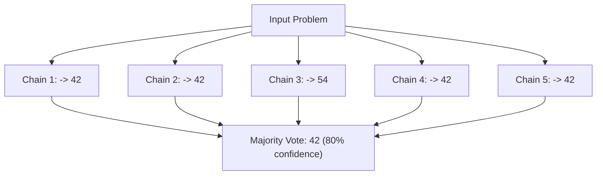
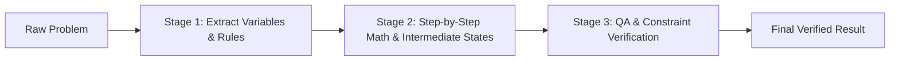

# Day 2 - Session 1: Chain-of-Thought & Task Decomposition

Welcome to **Day 2: Advanced Prompting & Structured Output**!

In **Session 1**, we explore how to dramatically enhance LLM performance on complex, multi-step reasoning tasks using **Chain-of-Thought (CoT)**, **Self-Consistency**, and **Task Decomposition (Prompt Chaining)**.

---

## 🎯 What You Will Learn

1. **Step-by-step reasoning (Chain-of-Thought)**:
   - What happens when a model generates intermediate thinking tokens before committing to an answer.
2. **Why it helps**:
   - Autoregressive computation spreads across token steps; transformer attention heads can attend to previously computed intermediate states.
3. **When it hurts**:
   - Latency and cost overhead for simple tasks.
   - Hallucination compounding (false intermediate premises propagating downstream).
4. **Self-Consistency**:
   - Generating multiple diverse reasoning paths (e.g., temperature 0.7) and taking a majority vote on the final answer.
5. **Prompt Chaining / Task Decomposition**:
   - Splitting a monolithic prompt into discrete, verifiable stages:
     - **Stage 1 (Extractor)**: Extract facts, numbers, and constraints into JSON.
     - **Stage 2 (Calculator/Reasoner)**: Methodically compute intermediate quantities.
     - **Stage 3 (Verifier)**: Cross-check constraints, fees, and bounds before finalizing the answer.
6. **Hands-On Task**:
   - Run a benchmark of 6 complex multi-step reasoning problems comparing **Single Direct Prompt** vs. **3-Step Decomposed Chain**, and measure accuracy.

---

## 🧠 Deep-Dive: Core Concepts

### 1. What is Chain-of-Thought (CoT) and Why Does It Help?
Large Language Models generate text one token at a time:
$$P(w_t \mid w_1, w_2, \dots, w_{t-1})$$

When you ask a model to produce the final answer *immediately* without showing work:
```text
Question: What is 48 * 27 - 135 / 5?
Prompt: Answer with only the number.
```
The model must perform all mathematical operations in a **single forward pass** through its neural network layers before generating the very first token. This often leads to guessing or arithmetic slips.

When you allow **Chain-of-Thought reasoning**:
```text
Question: What is 48 * 27 - 135 / 5?
Prompt: Let's calculate step by step:
1. First, 48 * 27 = 1,296.
2. Next, 135 / 5 = 27.
3. Finally, 1,296 - 27 = 1,269.
```
Each intermediate sentence becomes part of the model's context for subsequent tokens. The model uses its self-attention mechanism as an external working memory scratchpad.

---

### 2. When Does Step-by-Step Reasoning Hurt?
Chain-of-Thought is not a silver bullet for every task:

| Scenario | Impact of CoT | Recommendation |
| :--- | :--- | :--- |
| **Simple factual lookup** (*"Capital of France"*) | Wastes tokens and adds 500ms latency. | Use zero-shot direct prompt. |
| **Strict formatting constraints** (CSV, pure JSON) | Reasoning preamble can corrupt parser. | Enforce JSON mode or isolate reasoning inside a JSON key (`"reasoning"`). |
| **Plausible falsehoods** | If step 1 hallucinates a false fact, all subsequent steps logically build on that falsehood. | Add Stage 3 verification or grounding retrieval (RAG). |

---

### 3. What is Self-Consistency?
Instead of generating a single greedy decoding chain (`temperature=0.0`), **Self-Consistency** generates $N$ paths (e.g. 5 samples at `temperature=0.7`):


Self-consistency filters out individual arithmetic hiccups and significantly boosts mathematical reasoning accuracy.

---

### 4. What is Prompt Chaining (Decomposition)?
Instead of forcing one massive prompt to do extraction, calculation, error-checking, and formatting simultaneously, **Prompt Chaining** divides the workload into specialized steps:



#### Why Prompt Chaining Beats One Big Prompt:
1. **Separation of Concerns**: Stage 1 cannot make arithmetic mistakes because it only parses text.
2. **Debuggability**: If the final answer is wrong, you immediately know whether Stage 1 missed a variable or Stage 2 did the math incorrectly.
3. **Guardrails**: Stage 3 catches edge cases (like forgotten discount caps or administrative fees).

---

## 📊 Benchmark Dataset (6 Multi-Step Problems)

1. **Cloud Server Auto-Scaling Bill**:
   - Base server uptime (3 servers * 24h * 30d * $0.50/h = $1,080).
   - Peak hour surge (5 servers * 4h * 30d * $0.80/h = $480).
   - 10% volume discount before a fixed $50 maintenance fee.
   - **Ground Truth**: `$1454.00`.

2. **Warehouse Packaging & Pallet Logistics**:
   - Packing 1,750 widgets into 12-widget boxes (145 full boxes + 10 leftover widgets).
   - Leftovers in a padded envelope (1 envelope).
   - Palletizing boxes (145 // 25 = 5 pallets, 20 loose boxes).
   - Total containers: 5 pallets + 20 loose boxes + 1 envelope = **26**.

3. **Multi-Leg Flight Journey Duration**:
   - Flight 1: 6 hours with a 45-min departure delay.
   - Layover: Shortened to 2h 15m.
   - Flight 2: 7 hours with a 30-min headwind delay (7.5h).
   - Total elapsed duration = 6.75 + 2.25 + 7.5 = **16.5 hours**.

4. **Factory Machine Defect Rate**:
   - Machine A: 150 chips/hr * 8 hrs = 1,200 chips; 6% defects = 72 defects -> 1,128 good chips.
   - Machine B: 200 chips/hr * 5 hrs = 1,000 chips; 5% defects = 50 defects -> 950 good chips.
   - Total good chips = 1,128 + 950 = **2,078**.

5. **Subscription Downgrade Prorated Credit**:
   - $90 upfront for 30 days. Downgrade after 10 days to $30 plan for remaining 20 days.
   - Unused credit: $60. New plan cost: $20. Administrative fee: $5.
   - Net credit: $60 - $20 - $5 = **$35.00**.

6. **Engineering Sprint Story Point Capacity**:
   - 6 engineers * 8 hrs/day * 10 days = 480 gross hours.
   - 25% meetings/reviews overhead = 120 hrs.
   - Dedicated dev hours = 360 hrs / 3.6 hrs per point = **100 points**.

---

## 🚀 How to Run the Benchmark

### 1. Navigate to Session 1 Directory
```bash
cd day_02/session_1
```

### 2. Verify `.env` File
Make sure your API key and base URL are configured in `day_02/session_1/.env`:
```env
OPENAI_BASE_URL=https://generativelanguage.googleapis.com/v1beta/openai/
OPENAI_MODEL=gemini-3.5-flash-lite
OPENAI_API_KEY=your_key_here
```

## 📈 Empirical Benchmark Results

We executed the benchmark on `gemini-3.5-flash-lite`. Here are the actual test results:

```text
===============================================================================================
 COMPARATIVE BENCHMARK REPORT: SINGLE PROMPT VS 3-STEP CHAIN
===============================================================================================
ID   Problem Title                          Expected   Single       3-Step Chain Advantage
-----------------------------------------------------------------------------------------------
1    Cloud Server Auto-Scaling Bill         1454.0     1204.0 ❌     1454.0 ✅     Chain Won
2    Warehouse Packaging & Pallet Logisti   26.0       4.0 ❌        26.0 ✅       Chain Won
3    Multi-Leg Flight Journey Duration      16.5       16.5 ✅       16.5 ✅       Tie
4    Factory Machine Defect Rate            2078.0     1420.0 ❌     2078.0 ✅     Chain Won
5    Subscription Downgrade Prorated Cred   35.0       35.0 ✅       35.0 ✅       Tie
6    Engineering Sprint Story Point Capac   100.0      80.0 ❌       100.0 ✅      Chain Won
-----------------------------------------------------------------------------------------------
Method A (Single Direct Prompt) Accuracy   : 2/6 (33.3%)
Method B (3-Step Decomposed Chain) Accuracy: 6/6 (100.0%)
===============================================================================================
Accuracy Delta: +66.7% improvement via Task Decomposition & Chain-of-Thought!
===============================================================================================
```

### 🔬 Analysis of Why Single-Prompt Failed
1. **Skipping Constraints**: On Problem 2 (Warehouse Packaging), the single prompt returned `4.0` (skipping loose boxes and pallets calculation completely). The 3-Step chain extracted `widget_count: 1750` and `box_capacity: 12` first in Stage 1, enabling Stage 2 to calculate the modular division correctly.
2. **Mental Math Slip**: On Problem 4 (Factory Machine Defect Rate), the single prompt returned `1420.0` instead of `2078.0`. It failed to calculate Machine B's 5-hour cutoff accurately inside a single token pass.
3. **Order-of-Operations Blindness**: On Problem 1 (Cloud Server Bill), the single prompt applied the discount improperly. In the 3-step chain, Stage 1 explicitly highlighted: *"Discount applies before the maintenance fee is added"*, which Stage 3 verified.

