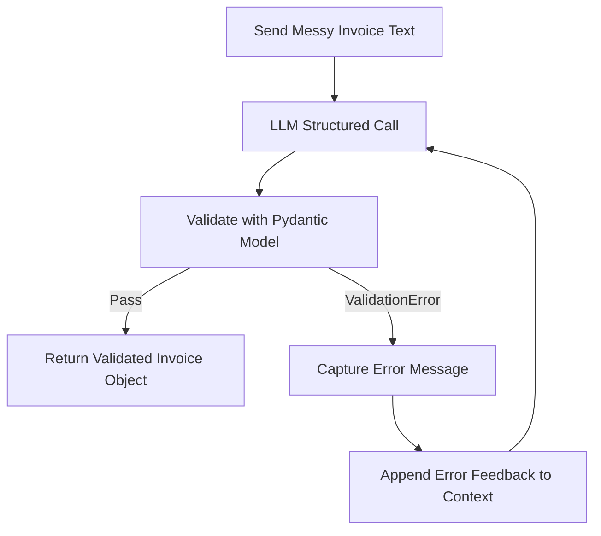

# Day 2 - Session 2: Structured Output & Pydantic Validation

Welcome to **Session 2** of **Day 2: Advanced Prompting & Structured Output**.

In this session, we tackle one of the most critical engineering challenges in production AI pipelines: **guaranteeing 100% syntactically and semantically valid structured data** from LLM extractions using **Pydantic** and the **Retry-on-Parse-Failure Pattern**.

---

## 🎯 What You Will Learn

1. **Forcing Valid JSON vs. Structured Outputs**:
   - *JSON Mode* (`{"type": "json_object"}`): Ensures valid JSON syntax (brackets and quotes), but cannot guarantee field presence or types.
   - *Structured Outputs / JSON Schema* (`client.beta.chat.completions.parse`): Constrains LLM token generation directly to a strict JSON Schema generated by a Pydantic model.
2. **Pydantic Models for Semantic Validation**:
   - Using `BaseModel`, `Field()`, type annotations, and `@field_validator` to enforce domain rules (e.g. positive dollar amounts, normalized `YYYY-MM-DD` dates, non-empty names).
3. **The Retry-on-Parse-Failure Pattern (Self-Correction Loop)**:
   - What happens when a model violates a schema or validation rule?
   - Instead of crashing, capture the exact Pydantic `ValidationError` and feed it back to the model as an error reflection prompt to auto-correct.
4. **Hands-On Task**:
   - Extract `name`, `company`, `amount`, and `date` from **15 messy, unstructured invoice texts** into a validated Pydantic model.

---

## 🧠 Core Architecture & Concepts

### 1. JSON Mode vs. Structured Outputs

| Feature | Regular JSON Mode | Structured Outputs (Pydantic / JSON Schema) |
| :--- | :--- | :--- |
| **API Parameter** | `response_format={"type": "json_object"}` | `client.beta.chat.completions.parse(response_format=Model)` |
| **Syntax Guarantee** | Valid JSON syntax | Valid JSON syntax |
| **Schema Guarantee** | ❌ Model may omit keys or hallucinate new ones | ✅ Every key and type strictly adheres to the schema |
| **Type Coercion** | ❌ May return `"amount": "$450"` (string) | ✅ Guaranteed `float` or fails validation |
| **SDK Integration** | Returns raw JSON string | Automatically parses into an instantiated Pydantic object |

---

### 2. Defining the Validated Pydantic Schema

```python
from pydantic import BaseModel, Field, field_validator
import re
from datetime import datetime

class Invoice(BaseModel):
    name: str = Field(description="Full name of customer or recipient")
    company: str = Field(description="Company or vendor organization name")
    amount: float = Field(gt=0, description="Total invoice dollar amount as positive float")
    date: str = Field(description="Invoice date normalized to YYYY-MM-DD")

    @field_validator("date")
    @classmethod
    def validate_date(cls, v: str) -> str:
        v = v.strip()
        if not re.match(r"^\d{4}-\d{2}-\d{2}$", v):
            raise ValueError(f"Date '{v}' must be YYYY-MM-DD format.")
        datetime.strptime(v, "%Y-%m-%d")  # Ensures valid calendar date
        return v
```

---

### 3. The Retry-on-Parse-Failure Pattern (Self-Correction Loop)

In production, models can occasionally stumble on edge cases (e.g., extracting an invalid date like `2024-02-31`). The **Retry-on-Parse-Failure** pattern creates a self-healing loop:



```python
for attempt in range(max_retries):
    try:
        response = client.beta.chat.completions.parse(
            model=MODEL,
            messages=conversation,
            response_format=Invoice,
            temperature=0.0
        )
        return response.choices[0].message.parsed
    except ValidationError as e:
        # Feed back the exact validation error
        conversation.append({"role": "user", "content": f"Fix this validation error: {e}"})
```

---

## 📊 Dataset: 15 Messy Real-World Invoices

1. **Conversational Slack/Email text**: `"Hey accounting, please process payment for Johnathan Doe over at Apex Global Logistics..."`
2. **Messy POS receipt snippet**: `"*** INVOICE RECEIPT *** VENDOR: CloudScale Technologies Inc. BILLED TO: Samantha Reed..."`
3. **Forwarded expense approval**: `"Dr. Robert Banner purchased lab hardware from Stark Industries costing 5420.75 USD..."`
4. **Internal memo with varied date**: `"Reimburse Emily Watson for HubSpot... $320.00 on 12-08-2023"`
5. **Multi-line order dump with subtotals**: `"Customer: Michael Chang, Seller: Datadog Enterprise Systems, Total: $2,900.00, Dated: March 3, 2024"`
6. **And 10 more real-world enterprise formats** covering AWS statements, Twilio usage, Atlassian subscriptions, Snowflake cloud invoices, and legal retainers.

---

## 🚀 How to Run the Benchmark

```bash
cd day_02/session_2
python main.py
```

The script will:
1. Process all 15 messy invoice texts through `client.beta.chat.completions.parse`.
2. Normalize all currency formats (e.g. `$1,450.00`, `5420.75 USD`) into pure positive `float` numbers.
3. Standardize diverse dates (`January 14, 2024`, `2023/11/05`, `April 19, 2024 14:32:00`) into strict `YYYY-MM-DD`.
## 📈 Empirical Extraction & Validation Results

We executed the benchmark on `gemini-3.5-flash-lite` across all 15 messy invoice texts. Every invoice passed Pydantic schema and semantic validation on the first attempt:

```text
===============================================================================================
 DAY 2 - SESSION 2: STRUCTURED OUTPUT & PYDANTIC EXTRACTION BENCHMARK
===============================================================================================
Model Under Test : gemini-3.5-flash-lite
Total Invoices   : 15
Target Schema    : Invoice(name: str, company: str, amount: float, date: YYYY-MM-DD)
===============================================================================================

ID   Name                 Company                      Amount ($)   Date         Status
-----------------------------------------------------------------------------------------------
1    Johnathan Doe        Apex Global Logistics        1450.00      2024-01-14   ✅ VALID
2    Samantha Reed        CloudScale Technologies In   899.50       2023-11-05   ✅ VALID
3    Dr. Robert Banner    Stark Industries             5420.75      2024-02-22   ✅ VALID
4    Emily Watson         HubSpot Marketing Hub        320.00       2023-12-08   ✅ VALID
5    Michael Chang        Datadog Enterprise Systems   2900.00      2024-03-03   ✅ VALID
6    Sarah Jenkins        CyberGuard Security Soluti   7500.00      2023-10-18   ✅ VALID
7    David Miller         Atlassian Corporation        450.25       2024-04-19   ✅ VALID
8    Priya Patel          Green Leaf Catering Co.      680.00       2024-05-02   ✅ VALID
9    Carlos Gomez         Snowflake Data Cloud         3120.40      2023-11-28   ✅ VALID
10   Rachel Green         Herman Miller Workspace      1280.00      2023-09-15   ✅ VALID
11   Alexander Wright     Twilio Communications Plat   195.60       2024-01-31   ✅ VALID
12   Elena Rostova        Baker & McKenzie LLP         3850.00      2023-07-10   ✅ VALID
13   James O'Connor       Amazon Web Services (AWS)    4120.85      2024-02-09   ✅ VALID
14   Fatima Al-Mansoor    Figma Design Inc             675.00       2023-12-20   ✅ VALID
15   Liam Murphy          Notion Labs Inc              240.00       2024-03-25   ✅ VALID
-----------------------------------------------------------------------------------------------

===============================================================================================
 EXTRACTION & VALIDATION REPORT
===============================================================================================
Total Invoices Processed : 15
Pydantic Validated       : 15/15 (100.0%)
Validation Enforcements  : Strict YYYY-MM-DD dates, Positive Floats, Non-Empty Strings
===============================================================================================
Session 2 task completed successfully!
===============================================================================================
```

