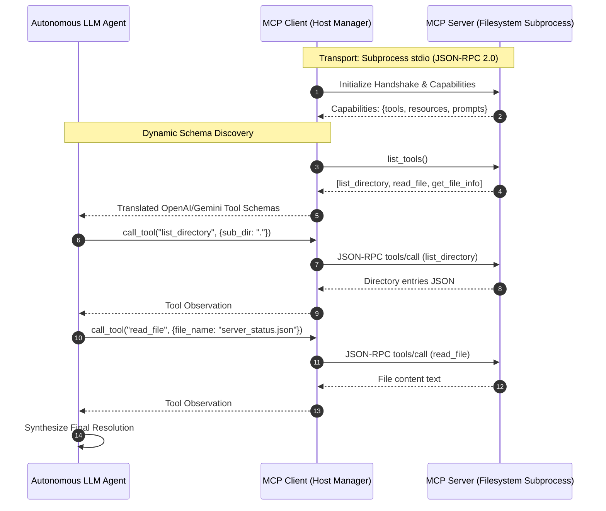

# Day 4 - Session 4: Model Context Protocol (MCP)

A production-grade implementation and architectural guide for connecting, discovering, and executing tools and resources via the open **Model Context Protocol (MCP)** specification.

---

## 1. Executive Summary & The Problem MCP Solves

### The $N \times M$ Integration Problem

Before the Model Context Protocol, the AI agent ecosystem was plagued by an **$N \times M$ integration bottleneck**:
- If there are **$N$ LLM clients/frameworks** (Claude Desktop, LangChain, LlamaIndex, AutoGen, CrewAI, Custom Agents),
- And **$M$ data sources / tool environments** (Filesystems, GitHub, PostgreSQL, Slack, Notion, Jira, Brave Search),
- Developers had to write and maintain **$N \times M$ custom wrappers and adapters**.

```
[WITHOUT MCP: Fragmented N x M Complexity]

  LangChain  ───────┬───────► PostgreSQL
                    ├───────► GitHub
  Claude App ───────┼───────► Local Filesystem
                    ├───────► Slack
  Custom Agent ─────┴───────► SQLite
    (Requires separate adapters for every client & data pair)
```

```
[WITH MCP: Standardized N + M Modularity]

  LangChain  ─────┐                       ┌─────► PostgreSQL Server
  Claude App ─────┼──► [MCP Open Protocol] ───┼─────► GitHub Server
  Custom Agent ───┘      (JSON-RPC 2.0)   └─────► Filesystem Server
    (Every client speaks ONE protocol; every tool exposes ONE server)
```

By decoupling LLMs from tool implementations via an open standard (**JSON-RPC 2.0** over standard input/output or HTTP/SSE), MCP allows any client to connect to any tool server dynamically without code changes.

---

## 2. Architecture: Servers, Clients, and Transports



### Core Roles

1. **MCP Host (Client)**:
   - The application orchestrating LLMs (e.g., our [`MCPAgent`](file:///c:/Users/harsh/OneDrive/Desktop/Agentic-AI/day_04/session_4/mcp_agent.py) and [`MCPClientManager`](file:///c:/Users/harsh/OneDrive/Desktop/Agentic-AI/day_04/session_4/mcp_client.py)).
   - Maintains the client session lifecycle, negotiates capabilities, and translates incoming queries into tool requests.
2. **MCP Server**:
   - Lightweight, standalone processes (e.g., [`filesystem_mcp_server.py`](file:///c:/Users/harsh/OneDrive/Desktop/Agentic-AI/day_04/session_4/filesystem_mcp_server.py)) that securely expose tools, data resources, and prompt templates.
3. **Transports**:
   - **`stdio`**: Communicates via standard input (`stdin`) and standard output (`stdout`) of a spawned subprocess. Ideal for local filesystem access, developer tools, and command-line utilities.
   - **`SSE / Streamable HTTP`**: Communicates over Server-Sent Events / HTTP. Ideal for remote microservices, cloud deployments, and SaaS integrations.

---

## 3. The Three MCP Primitives

| Primitive | Controller | Direction | Description & Use Case |
| :--- | :--- | :--- | :--- |
| **Tools** | **Model-Controlled** | Server ➔ LLM Execution | Dynamic functions exposed by the server. The LLM decides *when* and *with what arguments* to invoke them. |
| **Resources** | **Application-Controlled** | Server ➔ Context Injection | Read-only data addressed by standard URIs (e.g. `resource://system/server_status`). Passive contextual data attached to the model context. |
| **Prompts** | **User-Controlled** | Server ➔ Prompt Guidelines | Reusable prompt templates with predefined argument slots for standardized enterprise workflows. |

---

## 4. Module Breakdown

The session module is located at [`day_04/session_4/`](file:///c:/Users/harsh/OneDrive/Desktop/Agentic-AI/day_04/session_4):

```
day_04/session_4/
├── .env                         # API configuration (gemini-3-flash-preview)
├── requirements.txt             # Dependencies (mcp>=2.3.0, openai, python-dotenv)
├── filesystem_mcp_server.py    # Standardized MCP Server (Tools, Resources, Prompts)
├── mcp_client.py               # MCP Client Manager handling stdio transport
├── mcp_agent.py                # Dynamic Agent with zero hardcoded tools
├── main.py                     # Master verification & end-to-end demonstration
└── server_data/                # Managed sandbox filesystem
    ├── company_policy.md       # Operational & travel guidelines
    ├── project_manifest.txt    # Project roadmap and lead architect
    └── server_status.json      # Production datacenter health & metrics
```

### Detailed File Roles:

1. **[`filesystem_mcp_server.py`](file:///c:/Users/harsh/OneDrive/Desktop/Agentic-AI/day_04/session_4/filesystem_mcp_server.py)**:
   - Built on `mcp.server.mcpserver.MCPServer`.
   - Exposes 3 tools:
     - `list_directory(sub_dir)`: Sandboxed directory navigation.
     - `read_file(file_name)`: Safe UTF-8 file reader.
     - `get_file_info(file_name)`: File statistics (bytes, line count, extension).
   - Exposes 2 resources:
     - `resource://policy/company_policy`: Direct policy text.
     - `resource://system/server_status`: Live cluster metrics JSON.
   - Exposes 1 prompt template:
     - `review_operations_policy`: Parameterized compliance prompt.
   - Runs as an independent process via `server.run(transport="stdio")`.

2. **[`mcp_client.py`](file:///c:/Users/harsh/OneDrive/Desktop/Agentic-AI/day_04/session_4/mcp_client.py)**:
   - Encapsulates `mcp.Client` and `mcp.StdioServerParameters`.
   - Handles subprocess spawning, JSON-RPC communication, error routing, and schema extraction.
   - Provides methods: `list_tools()`, `call_tool()`, `list_resources()`, `read_resource()`, `list_prompts()`, `get_prompt()`.

3. **[`mcp_agent.py`](file:///c:/Users/harsh/OneDrive/Desktop/Agentic-AI/day_04/session_4/mcp_agent.py)**:
   - **Zero hardcoding**: Tool schemas are discovered dynamically from the MCP server at runtime.
   - Automatically translates MCP `input_schema` into OpenAI/Gemini tool specifications.
   - Implements thought-signature preserving multi-turn ReAct loops.

4. **[`main.py`](file:///c:/Users/harsh/OneDrive/Desktop/Agentic-AI/day_04/session_4/main.py)**:
   - Runs the mandatory two-tool execution over stdio.
   - Demonstrates all three MCP primitives.
   - Executes the autonomous agent end-to-end.

---

## 5. Execution Results & Verification

### Part 1: Mandatory Tool Invocations via Stdio Client

```text
================================================================================
 PART 1: CONNECTING TO MCP SERVER OVER STDIO & CALLING TOOLS
================================================================================
Connecting to MCP Server subprocess via stdio transport:
  Target Server Script: .../day_04/session_4/filesystem_mcp_server.py
[+] Stdio JSON-RPC connection successfully established with MCP Server.

--- 1. Dynamic Capability Discovery ---
Discovered 3 Tools:
  • Tool: list_directory     | Description: List all files and subdirectories located within the managed server filesystem sandbox.
  • Tool: read_file          | Description: Read the complete text content of a specified file from the managed server filesystem.
  • Tool: get_file_info      | Description: Retrieve structural metadata for a file including size, line count, character count, and extension.

Discovered 2 Resources:
  • URI: resource://policy/company_policy     | Name: Company Operations Policy
  • URI: resource://system/server_status      | Name: Cluster Server Status

Discovered 1 Prompts:
  • Prompt: review_operations_policy  | Description: Predefined prompt template to audit compliance against corporate policies

================================================================================
 MANDATORY TASK: CALL TWO MCP SERVER TOOLS
================================================================================

--- Invocation 1: 'list_directory' (Tool 1) ---
Client -> Server JSON-RPC Request: call_tool('list_directory', {'sub_dir': '.'})
Server -> Client Response Status: SUCCESS
Received Directory Listing:
  [FILE ] company_policy.md        (677 bytes)
  [FILE ] project_manifest.txt     (439 bytes)
  [FILE ] server_status.json       (627 bytes)

--- Invocation 2: 'read_file' (Tool 2) ---
Client -> Server JSON-RPC Request: call_tool('read_file', {'file_name': 'company_policy.md'})
Server -> Client Response Status: SUCCESS
Received File Content Snippet:
  | # Enterprise Global Operations Policy
  | Document Ref: DOC-OPS-2026-V4
  | Classification: Internal Tier-2 Document
  | 
  | ## 1. Remote Work & Travel Expenditure
  | - Daily hotel reimbursement ceiling: $280/night in primary tech hubs (San Francisco, NYC, London).
  | - Per diem food allowance: $85/day flat rate without individual receipt audit requirement.
  | - International business travel: Flights exceeding 6 hours are eligible for Business Class booking.
```

### Part 2: Autonomous Agent Multi-Turn MCP Execution

**User Prompt:**
> "Inspect our filesystem repository. Identify any degraded services in the server status file and state the alert details. Then check the company operations policy for international travel and state the flight duration required for business class qualification."

**Execution Trace:**
```text
[Agent Started] Goal: "Inspect our filesystem repository..."
[Dynamic MCP Tools Available]: ['list_directory', 'read_file', 'get_file_info']

--- Turn 1 / 6 ---
 -> Invoking MCP Server Tool: list_directory({"sub_dir": "."})
 <- Observation from MCP Server: {"result": [{"name": "company_policy.md", ...}]}

--- Turn 2 / 6 ---
 -> Invoking MCP Server Tool: read_file({"file_name": "server_status.json"})
 <- Observation from MCP Server: {"result": "{\n  \"datacenter\": \"us-east-cluster-primary\"..."}

--- Turn 3 / 6 ---
 -> Invoking MCP Server Tool: read_file({"file_name": "company_policy.md"})
 <- Observation from MCP Server: {"result": "# Enterprise Global Operations Policy\n..."}

--- Turn 4 / 6 ---
[Agent Completed] Final answer generated on turn 4.
```

**Final Answer Synthesized by LLM:**
> **Server Status:**
> The `vector-search-engine` is currently identified as a degraded service.
> - **Alert Details:** "High memory consumption on Node 03 (91% VRAM)"
> - **Source File:** `server_status.json`
>
> **International Travel Policy:**
> According to the company operations policy, business class qualification for international travel is:
> - **Requirement:** Flights exceeding **6 hours** are eligible for Business Class booking.
> - **Source File:** `company_policy.md` (Section 1: Remote Work & Travel Expenditure)

**Tool Execution Audit Trail:**
| Turn | Tool Executed | Arguments | Observation Length |
| :---: | :--- | :--- | :---: |
| 1 | `list_directory` | `{"sub_dir": "."}` | 349 bytes |
| 2 | `read_file` | `{"file_name": "server_status.json"}` | 716 bytes |
| 3 | `read_file` | `{"file_name": "company_policy.md"}` | 703 bytes |

---

## 6. How to Run the Verification

### 1. Run the Direct MCP Client Demo (Two Tool Calls over stdio)
```bash
python day_04/session_4/mcp_client.py
```

### 2. Run the Full End-to-End Suite (MCP Protocol + Autonomous Agent)
```bash
python day_04/session_4/main.py
```
