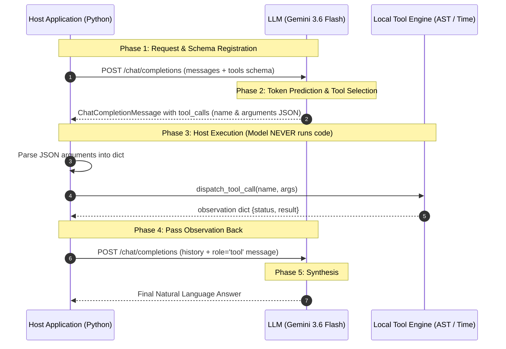

# Day 6 - Session 1: How Tool Calling Works

A comprehensive architectural and practical implementation of **LLM Tool Calling & Function Execution** using OpenAI/Gemini standards.

---

## 1. Core Architecture: The Request -> Execute -> Return Loop



### The 5 Phases:
1. **Phase 1 (Tool Registration)**: The host passes the conversation history and a list of JSON Schema function definitions via the `tools` parameter.
2. **Phase 2 (Model Decision)**: The LLM reads the user prompt. If external information or computation is needed, the model emits a structured `tool_calls` payload containing a unique `tool_call_id`, the function `name`, and serialized JSON `arguments`.
3. **Phase 3 (Host Execution)**: The host runtime intercepts the request, validates arguments, and executes the local Python function.
4. **Phase 4 (Observation Return)**: The host serializes the execution result into a message with `role="tool"` and matching `tool_call_id`, appending it to the conversation history.
5. **Phase 5 (Final Synthesis)**: The host sends the updated message chain back to the LLM, which incorporates the observation into its final response.

---

## 2. Why the Model Never Runs Code Itself

A frequent misconception is that language models "run tools" or "execute code" inside their neural network. In reality:

| Dimension | The Model (LLM) | The Host Application (Python) |
| :--- | :--- | :--- |
| **Nature** | Pure mathematical token predictor (weights & tensor operations). | Concrete OS execution process with CPU, RAM, and sockets. |
| **Capabilities** | String pattern recognition and symbolic text generation. | System calls, network I/O, database queries, mathematical ALUs. |
| **Output** | Emits a structured JSON string indicating **intent** (e.g. `{"expression": "450 * 18"}`). | Parses the string and evaluates the real function safely. |
| **Security Sandbox** | Has zero awareness of external state or file systems. | Enforces security boundaries, timeouts, permissions, and validation. |

> [!IMPORTANT]
> The model only generates **symbolic requests**. If your host code does not execute the function and pass the result back, nothing happens.

---

## 3. Tool Choice Controls (`tool_choice`)

The `tool_choice` parameter governs how the LLM decides whether to call tools:

| Mode | Specification | Behavior |
| :--- | :--- | :--- |
| **Automatic** | `tool_choice="auto"` | The default mode. The model autonomously determines whether to call one or more tools, or reply directly with text. |
| **Forbidden** | `tool_choice="none"` | The model is strictly prohibited from emitting tool calls. It will answer using only its pre-trained weights. |
| **Forced Specific** | `tool_choice={"type": "function", "function": {"name": "calculator"}}` | The model is **forced** to emit a tool call targeting the designated function, even if the user prompt is casual conversational text. |

---

## 4. Parallel Tool Calling

Modern frontier models can emit **multiple tool calls in a single turn**. For example, given the prompt:
> *"What time is it in New York and what is (8500 * 1.18) - 450?"*

Instead of two round trips, the model returns **two simultaneous tool calls** in `response.choices[0].message.tool_calls`:
1. `call_749907`: `get_time(timezone="America/New_York")`
2. `call_749908`: `calculator(expression="(8500 * 1.18) - 450")`

The host executes both tools and appends both `role="tool"` messages before issuing the second turn synthesis.

---

## 5. Module Structure

All files reside in [`day_06/session_1/`](file:///c:/Users/harsh/OneDrive/Desktop/Agentic-AI/day_06/session_1):

```
day_06/session_1/
├── .env                # Gemini 3.6 Flash configuration
├── requirements.txt    # openai, python-dotenv, pydantic, tzdata
├── tools.py            # Safe AST-based calculator & IANA get_time
├── schemas.py          # JSON Schemas and Pydantic argument models
├── tool_loop.py        # Core Request-Execute-Return engine with rate-limit backoff
├── main.py             # Master verification suite across 3 scenarios
└── README.md           # Architectural documentation
```

### Module Breakdown:
1. [`tools.py`](file:///c:/Users/harsh/OneDrive/Desktop/Agentic-AI/day_06/session_1/tools.py):
   * `calculator(expression)`: Uses Python's `ast` (Abstract Syntax Tree) to parse mathematical expressions recursively without using dangerous `eval()`. Prevents division by zero and exponential explosions.
   * `get_time(timezone)`: Retrieves real-world time across worldwide IANA timezones using Python 3.9+ `zoneinfo` and `tzdata`.
   * `dispatch_tool_call(tool_name, arguments)`: Central dispatcher returning typed observations.
2. [`schemas.py`](file:///c:/Users/harsh/OneDrive/Desktop/Agentic-AI/day_06/session_1/schemas.py):
   * Standard OpenAI JSON schemas with model-facing descriptions and parameter specifications.
   * Pydantic v2 `CalculatorInput` and `GetTimeInput` models for argument validation.
3. [`tool_loop.py`](file:///c:/Users/harsh/OneDrive/Desktop/Agentic-AI/day_06/session_1/tool_loop.py):
   * Encapsulates the entire Request-Execute-Return loop.
   * Features `_create_completion_with_backoff` to handle free-tier 5 RPM rate limits automatically.
   * Measures millisecond execution latency and tracks conversation history.
4. [`main.py`](file:///c:/Users/harsh/OneDrive/Desktop/Agentic-AI/day_06/session_1/main.py):
   * Orchestrates the 3 core verification scenarios.

---

## 6. Execution Trace & Audit Log

### Scenario 1: Single Tool Execution (`get_time`)
```text
User Prompt: "What is the current time in Tokyo, Japan, and what day of the week is it?"
Configured tool_choice: auto

--- [Tool Call 1/1] ID: call_775823 ---
  Target Function: get_time
  Raw Arguments JSON from Model: {"timezone":"Asia/Tokyo"}
  -> HOST EXECUTION: Executing local function 'get_time' safely...
  <- HOST EXECUTION COMPLETE (5.37 ms)
  Observation: {
    "status": "success",
    "requested_timezone": "Asia/Tokyo",
    "formatted_datetime": "2026-10-05 21:43:12 JST",
    "day_of_week": "Monday"
  }

Final Answer:
The current time in Tokyo, Japan, is 9:43 PM JST (21:43), and the day of the week is Monday (October 5, 2026).
```

### Scenario 2: Parallel Tool Calling (Multi-Tool Dispatch)
```text
User Prompt: "1. What is the current time in New York? 2. What is (8500 * 1.18) - 450?"
Model Tool Calls Emitted: 2

--- [Tool Call 1/2] ID: call_871595 ---
  Target Function: get_time
  Arguments: {"timezone":"America/New_York"}
  Host Latency: 1.46 ms

--- [Tool Call 2/2] ID: call_871596 ---
  Target Function: calculator
  Arguments: {"expression":"(8500 * 1.18) - 450"}
  Host Latency: 0.06 ms
  Observation Result: 9580

Final Answer:
1. Current time in New York: 8:43 AM EDT (Monday, October 5, 2026)
2. Calculation result: 9,580
```

### Scenario 3: `tool_choice` Controls
```text
Prompt: "What is 150 * 12 + 400?"

Run 3A (tool_choice="none"):
  Tools Requested: 0
  Behavior: Model forbidden from executing tools; replied with direct text.

Run 3B (tool_choice=forced 'calculator'):
  Tools Requested: 1
  Behavior: Model forced to emit calculator call -> 2,200.
```

### Master Audit Summary
| Scenario | `tool_choice` | Tools Called | Total Duration |
| :--- | :---: | :---: | :---: |
| **1. Single Tool (`get_time`)** | `auto` | 1 | 4.65s |
| **2. Parallel (`time` + `calc`)** | `auto` | 2 | 6.24s |
| **3A. `tool_choice="none"`** | `none` | 0 | 5.36s |
| **3B. Forced `calculator`** | forced | 1 | 40.48s (incl. RPM backoff) |

---

## 7. How to Run Locally

Activate the workspace virtual environment and execute `main.py`:

```powershell
.venv\Scripts\activate
python day_06/session_1/main.py
```
