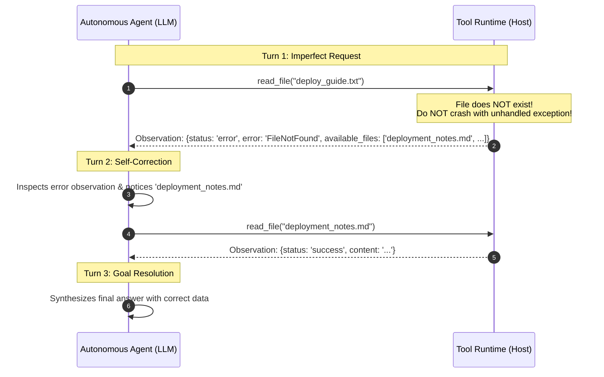

# Day 6 - Session 2: Designing Good Tools

A production architectural guide and complete practical implementation demonstrating the 5 gold standards of **Agent Tool Design**:
1. Unambiguous **Naming Conventions**.
2. **Model-Facing Descriptions** (written for the LLM, not software developers).
3. **Strict Typed & Validated Arguments**.
4. **Keeping Active Tool Count Under ~10** (preventing context bloating & tool confusion).
5. **Returning Errors as Observations** (enabling autonomous self-correction).

---

## 1. Core Principles of Good Tool Design

### Principle 1: Explicit Verb-Noun Naming
* **Poor**: `data_fetcher`, `handle`, `run_op`, `utils`
* **Good**: `web_search`, `read_file`, `query_sqlite`, `call_external_api`, `send_email`
* **Why**: LLM routing relies heavily on semantic token similarity between user intent and the tool identifier. Verb-noun naming clearly conveys action and entity.

### Principle 2: Descriptions Written for the Model, Not the Developer
Developer docstrings describe internal mechanics (e.g. *"Uses sqlite3 connector with row_factory"*).
**Model-facing descriptions** answer the questions an LLM needs to make decisions:
1. **When should I pick this tool?** (*"Call this when searching external documentation..."*)
2. **When should I NOT pick this tool?** (*"Do NOT use this tool for internal employee compensation..."*)
3. **What is the expected input format?** (*"Must be a standard SQL SELECT statement..."*)
4. **How do I recover from failures?** (*"If an error occurs, the observation returns table schema hints..."*)

### Principle 3: Typed & Validated Arguments
* Reject bad arguments early at the client boundary with descriptive hints before triggering runtime crashes.
* Use Pydantic v2 regex patterns (e.g. email format validation), ranges (`ge=1, le=5`), and enums (`method in ['GET', 'POST']`).

### Principle 4: Keeping Tool Count Under ~10
* Providing 20+ tools to an LLM drastically increases token consumption, creates semantic overlap, and induces hallucinated or mismatched tool calls.
* A curated set of **5 well-scoped, complementary tools** provides complete autonomy without degrading tool selection accuracy.

### Principle 5: Returning Errors as Observations (The Self-Correction Loop)



When a tool catches an operational failure and returns it as a formatted observation:
1. The host Python process never crashes.
2. The agent inspects the corrective feedback in the next turn.
3. The agent self-corrects its query autonomously.

---

## 2. The 5 Built Tools

| Tool | Purpose | Model-Facing Guardrails | Error Recovery Feature |
| :--- | :--- | :--- | :--- |
| **`web_search`** | Searches public technical docs & specifications. | Boundaries: blocked from querying internal databases. | Suggests alternative keywords on zero matches. |
| **`read_file`** | Reads documentation in safe sandbox workspace. | Path traversal guardrail (`..` blocked). Line limit truncation. | If file is missing, lists all valid files in sandbox. |
| **`query_sqlite`** | Read-only SQL queries on enterprise database. | Blocks destructive SQL keywords (`DROP`, `DELETE`, `UPDATE`, `ALTER`). | On SQL syntax error, returns full table schemas and column lists. |
| **`call_external_api`** | REST HTTP client for microservice telemetry. | Validates HTTP methods (`GET`, `POST`) and timeout budgets (8s). | Returns HTTP status codes and timeout details as observation. |
| **`send_email`** | Official dispatch with immutable audit logging. | Regex email format validation. Subject/body length bounds. | Returns specific validation message on invalid email address. |

---

## 3. Directory Layout

All files are located in [`day_06/session_2/`](file:///c:/Users/harsh/OneDrive/Desktop/Agentic-AI/day_06/session_2):

```
day_06/session_2/
├── .env                    # Gemini 3.6 Flash configuration
├── requirements.txt        # openai, python-dotenv, pydantic, requests
├── database_setup.py       # Seeds enterprise_data.db (employees, products, orders)
├── enterprise_data.db      # SQLite relational database
├── sandbox/                # Safe sandbox directory
│   ├── deployment_notes.md # Operational protocol & canary rollback triggers
│   └── quarterly_targets.txt# Q4 2026 strategic milestones
├── tools.py                # 5 production tools implementing error-as-observation
├── schemas.py              # Model-facing JSON Schemas & Pydantic models
├── agent_recovery.py       # Autonomous agent demonstrating self-correction loop
├── main.py                 # Master verification script
├── sent_emails.jsonl       # Immutable audit log of email dispatches
└── README.md               # Architectural documentation
```

---

## 4. Verification Results

### Part 1: Direct Tool Verification
```text
================================================================================
 PART 1: VERIFYING THE 5 DESIGNED TOOLS
================================================================================

 Tool 1/5: web_search
Status: success | Results Found: 1
  • Model Context Protocol (MCP) Specification & Architecture
    Snippet: MCP standardizes how applications provide context to LLMs...

 Tool 2/5: read_file (Safe Sandbox Reader)
Status: success | File: deployment_notes.md | Total Lines: 13
Content Preview:
# Enterprise Deployment & Infrastructure Protocol
Release: v3.4.0-Production...

 Tool 3/5: query_sqlite (Read-Only SQL with Schema Hints)
Status: success | Rows Returned: 4
  • Elena Rostova | VP of Product | $195,000.00
  • Alice Chen | Principal AI Architect | $185,000.00
  • Sophia Patel | MLOps Infrastructure Lead | $170,000.00
  • David Miller | Head of FP&A | $160,000.00

 Tool 4/5: call_external_api (REST / Microservice Client)
Status: success | Endpoint: mock://cluster/metrics | HTTP Code: 200
Cluster Metrics: {
  "active_nodes": 16,
  "cluster_cpu_utilization_pct": 42.8,
  "gateway_status": "HEALTHY"
}

 Tool 5/5: send_email (Mock Dispatch with Validation & Audit)
Status: success | Message ID: MSG-E4FF4311 | Recipient: elena.rostova@enterprise.io
Delivery Receipt: DELIVERED_TO_GATEWAY
```

### Part 2: Self-Correction Error Recovery Loop

**User Goal:**
> *"Please inspect the sandbox file 'deploy_guide.txt' to tell me what our emergency rollback triggers are for 5xx error rate and latency."*

**Turn 1: Model makes mistake based on user prompt:**
```text
>>> TURN 1 / 4 <<<
  -> Model Requested Tool: read_file({"file_path": "deploy_guide.txt"})
  ⚠️ TOOL RETURNED ERROR OBSERVATION: FileNotFound
     Feedback Sent to Model: File 'deploy_guide.txt' does not exist in sandbox.
     Available files in sandbox: ['deployment_notes.md', 'quarterly_targets.txt']
```

**Turn 2: Model reads the observation and self-corrects autonomously:**
```text
>>> TURN 2 / 4 <<<
  -> Model Requested Tool: read_file({"file_path": "deployment_notes.md"})
  ✅ MODEL SUCCESSFULLY SELF-CORRECTED on Turn 2!
  ✓ Tool Execution Succeeded.
```

**Turn 3: Model synthesizes final response:**
```text
Final Answer:
Based on the sandbox deployment documentation (found in deployment_notes.md), the emergency rollback triggers for 5xx error rate and latency are:

* HTTP 5xx Error Rate: Exceeds 0.5% over a 3-minute sliding window.
* Latency: p99 exceeds 250ms for authenticated user transactions.
```

---

## 5. How to Run

```powershell
.venv\Scripts\activate
python day_06/session_2/main.py
```
