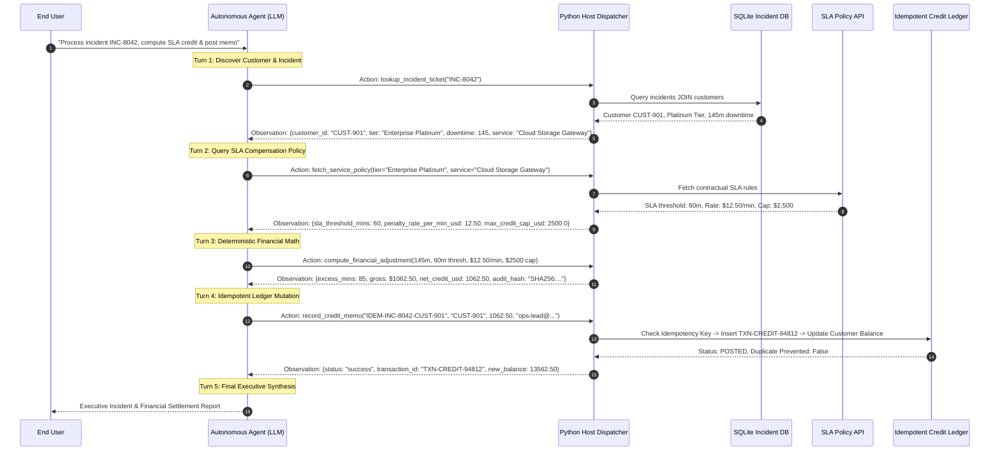

# Day 6 - Session 3: Multi-Step Tool Use

A production architectural guide and complete practical implementation demonstrating **Multi-Step Tool Orchestration**:
1. **Chaining Calls**: Sequentially passing outputs from step $N$ to parameters of step $N+1$.
2. **Feeding Results Back into Context**: Structuring conversation messages with `role="tool"` observations.
3. **Conversation History Growth**: Measuring token compound effects turn-by-turn.
4. **When to Summarise or Truncate**: Controlling context bloat via payload truncation and milestone compaction.
5. **Partial Failure Handling**: Surviving mid-chain errors with structured observation feedback.
6. **Idempotency**: Guaranteeing side-effect safety on financial mutations and retry operations.

---

## 1. Architecture of the 4-Tool Chain



---

## 2. Core Concepts Deep Dive

### 1. Chaining Calls
In single-step tool execution, the model answers after one invocation. In **Multi-Step Tool Use**, the model cannot solve the objective upfront because required inputs depend on intermediate discoveries:
* To query SLA rules, the agent needs the **Customer Tier** and **Service Name** (discovered in Step 1).
* To compute penalties, the agent needs **Downtime Minutes** (Step 1) and **SLA Threshold & Rate** (Step 2).
* To issue credit, the agent needs the **Audited Amount** (Step 3) and **Account Profile** (Step 1).

### 2. Feeding Results Back into Context
In modern LLM tool-calling protocols (OpenAI standard), tools do not return values directly to Python variables inside the LLM prompt. Instead:
1. The model emits an `assistant` message containing `tool_calls` with unique IDs (`call_abc123`).
2. The host executes the local Python function and wraps the result as a `tool` role message:
   ```json
   {
     "role": "tool",
     "tool_call_id": "call_abc123",
     "name": "lookup_incident_ticket",
     "content": "{\"status\": \"success\", \"customer_id\": \"CUST-901\", ...}"
   }
   ```
3. This message is appended to the conversation history, allowing the LLM on Turn 2 to condition its next reasoning on the newly injected observation.

### 3. Conversation History Growth & Token Compounds
With every turn:
$$\text{Tokens}_{\text{Turn } K} = \text{Tokens}_{\text{Prompt}} + \sum_{i=1}^{K} (\text{Tokens}_{\text{Assistant } i} + \text{Tokens}_{\text{Observation } i})$$
For a 4-step workflow, raw observations can consume thousands of tokens if unmonitored.

### 4. When to Summarise or Truncate
Two techniques are implemented in [`history_manager.py`](file:///c:/Users/harsh/OneDrive/Desktop/Agentic-AI/day_06/session_3/history_manager.py):
1. **Payload Truncation**: When tools return large payloads (e.g. 100 database rows or full HTML pages), verbose diagnostic attributes are stripped, keeping only the high-signal keys before returning to the model.
2. **Context Compaction**: When conversation tokens cross a threshold (e.g. 1,800 tokens), completed intermediate steps are summarized into a concise system milestone (`[CONTEXT COMPACTION MILESTONE]: Steps 1-2 verified: CUST-901, Platinum Tier, SLA $12.50/min`), freeing up context space for downstream steps.

### 5. Partial Failure Handling
If Step 2 or 3 encounters an issue (e.g. invalid arguments or missing database record):
- The tool returns a structured observation: `{"status": "error", "error_type": "...", "message": "...", "hints": [...]}`.
- Because the exception was caught by the host, the process continues and the agent reads the hint, self-correcting on the subsequent turn.

### 6. Idempotency (Zero Double-Crediting Guarantee)
A side-effecting operation (like charging a credit card or issuing a refund) must **never execute twice** even if:
- The network drops before the LLM receives the confirmation.
- The user or agent retries the call.

In [`tools.py`](file:///c:/Users/harsh/OneDrive/Desktop/Agentic-AI/day_06/session_3/tools.py), `record_credit_memo` enforces:
1. A unique `idempotency_key` constraint in the SQLite ledger table.
2. Before modifying balances, the tool checks if the key exists.
3. If found, it returns the previously posted transaction receipt with `"idempotent_replay": true`, preventing duplicate credits.

---

## 3. Directory Layout

```
day_06/session_3/
├── .env                     # Local model configuration (gemini-3.1-flash-lite)
├── requirements.txt         # Dependencies
├── database_setup.py        # SQLite schema (customers, incidents, credit_ledger)
├── incident_system.db       # Seeded database instance
├── tools.py                 # The 4 tools & central dispatcher with idempotency logic
├── schemas.py               # OpenAI JSON schemas and Pydantic validation models
├── history_manager.py       # Token telemetry, payload truncation & compaction
├── multi_step_agent.py      # Autonomous agent with ReAct Thought/Action/Observation logging
├── main.py                  # Master demonstration script
└── README.md                # Architectural documentation
```

---

## 4. Execution & Verification

Run the master demonstration script:
```powershell
.venv\Scripts\python.exe day_06\session_3\main.py
```
