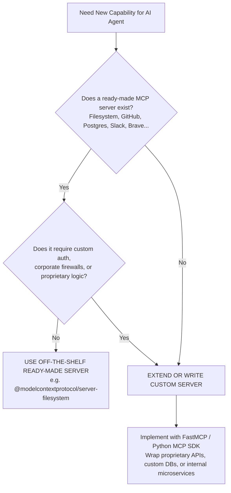

# Day 6 - Session 4: Model Context Protocol (MCP)

A production architectural guide and practical demonstration of the **Model Context Protocol (MCP)**:
1. **The Problem MCP Solves**: Eliminating the $M \times N$ integration problem through an open standard.
2. **Client vs Server Architecture**: Responsibilities of MCP Hosts (Clients) vs MCP Capability Providers (Servers).
3. **The Three Core MCP Primitives**: **Tools** (executable actions), **Resources** (passive contextual data), and **Prompts** (parameterized templates).
4. **Transport Protocols**: Local process `stdio` vs remote `SSE / HTTP`.
5. **When to Write Your Own Server vs Use Off-The-Shelf**: Pragmatic decision frameworks.
6. **Live Hands-On Execution**: Connecting the official ready-made `@modelcontextprotocol/server-filesystem` MCP server and invoking three tools successfully.

---

## 1. The Problem MCP Solves: The $M \times N$ Complexity

Before MCP, integrating $M$ AI applications with $N$ enterprise data sources required building and maintaining custom bespoke connectors for every combination:

```
WITHOUT MCP (M × N Integrations):
   ChatGPT    Claude     Antigravity   Custom Agent
      \         |           |             /
       \        |           |            /
        v       v           v           v
   [ Postgres | Filesystem | GitHub | Jira | Slack ]
   (Each model/app requires a separate proprietary connector!)
```

MCP standardizes the interface using JSON-RPC 2.0:
```
WITH MCP (M + N Integrations):
   ChatGPT    Claude     Antigravity   Custom Agent
      \         |           |             /
       ---->[ Unified MCP Client Protocol ]<----
                         |
                         v
       ---->[ Standardized JSON-RPC 2.0 ]<------
                         |
       +-----------------+-----------------+
       |                 |                 |
       v                 v                 v
  MCP Server        MCP Server        MCP Server
 (Filesystem)        (GitHub)         (Postgres)
```

By decoupling clients from servers, adding a new model requires 1 client adapter, and adding a new tool requires 1 server. Total complexity collapses from **$M \times N$** to **$M + N$**.

---

## 2. Client vs Server Roles

| Component | Role | Responsibilities |
| :--- | :--- | :--- |
| **MCP Client (Host)** | Orchestrator / User Agent | <ul><li>Initiates child processes or HTTP sessions</li><li>Performs capability negotiation during handshake</li><li>Prompts the LLM with converted tool schemas</li><li>Relays tool invocations to the server and feeds observations back to the LLM</li></ul> |
| **MCP Server** | Capability Provider | <ul><li>Exposes Tools, Resources, and Prompts</li><li>Validates input arguments according to JSON Schema</li><li>Executes local operations (filesystem, database, API)</li><li>**Never calls an LLM directly**; purely serves capabilities to the client</li></ul> |

---

## 3. The Three Core MCP Primitives

1. **Tools** (Active / Executable):
   - Executable functions with typed JSON schema parameters.
   - Invoked explicitly by the model when it decides an action is required (e.g., `read_file`, `write_file`, `execute_query`).
2. **Resources** (Passive / Contextual):
   - Read-only data sources addressed by standardized URIs (e.g., `file:///sandbox/config.json`, `postgres://schema/public`).
   - Attached as ambient background context to user prompts.
3. **Prompts** (Reusable User Templates):
   - Server-provided, parameterized prompt templates (e.g., `analyze-codebase(repo_name, depth)`).
   - Enables server authors to bundle recommended prompt engineering directly with the tool capabilities.

---

## 4. Transport Protocols: `stdio` vs `SSE / HTTP`

| Dimension | `stdio` (Standard I/O) | `SSE / HTTP` (Server-Sent Events) |
| :--- | :--- | :--- |
| **Mechanics** | Client spawns server as a child process; exchanges JSON-RPC over `stdin`/`stdout`. | Client sends JSON-RPC via HTTP POST and receives streaming responses via Server-Sent Events. |
| **Security** | Process boundary isolation; zero network exposure. | Requires HTTPS, bearer tokens, and firewall configuration. |
| **Deployment** | Local machine, CLI tools, IDE plugins (e.g. Claude Desktop, Antigravity). | Remote servers, cloud microservices, multi-tenant SaaS. |
| **Latency** | Extremely low (microseconds IPC). | Network latency dependent (50–200ms). |

---

## 5. When to Write Your Own Server vs Use Off-The-Shelf



---

## 6. Directory Structure

```
day_06/session_4/
├── .env                     # Configuration (gemini-3.1-flash-lite)
├── requirements.txt         # Dependencies (mcp, openai, pydantic, python-dotenv)
├── sandbox/                 # Managed filesystem directory accessible by server
│   ├── system_manifest.json # Baseline environment configuration
│   ├── cluster_audit.json   # Generated via direct MCP tool call
│   └── incident_mitigation.md # Generated via autonomous agent
├── mcp_client_manager.py    # MCP Client managing stdio lifecycle & tool execution
├── mcp_agent.py             # Autonomous ReAct agent consuming live MCP tools
├── main.py                  # Master verification script
└── README.md                # Comprehensive documentation
```

---

## 7. Execution & Verification

Run the master demonstration script:
```powershell
.venv\Scripts\python.exe day_06\session_4\main.py
```
