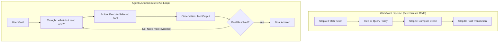
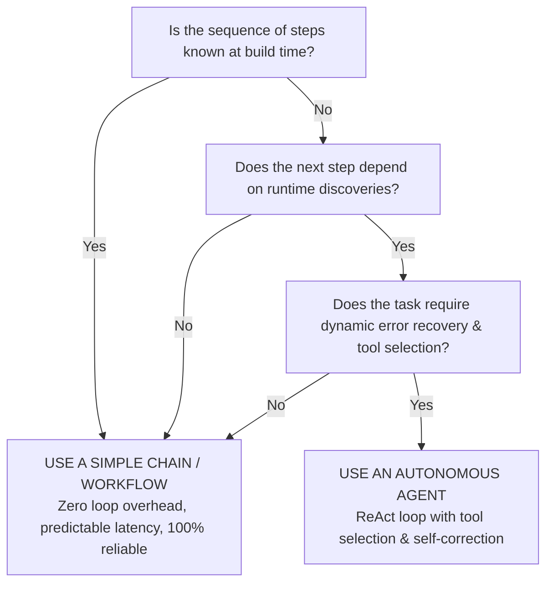

# Day 7 - Session 1: Agent Fundamentals & The Bare ReAct Loop

A foundational architectural guide and framework-free implementation demonstrating:
1. **Workflow vs Agent**: The architectural boundary between deterministic pipelines and autonomous loops.
2. **The ReAct Loop**: Synergizing **Reasoning (Thought)** and **Acting (Action $\rightarrow$ Observation)**.
3. **Planning vs Reactive**: Evaluating static upfront decomposition against dynamic step-by-step adaptation.
4. **The "Agent vs Chain" Decision Rubric**: Recognizing when a simple linear chain is optimal and when an agent is over-engineering.
5. **Bare ReAct Implementation**: A pure Python ReAct loop in **roughly 70 lines of code** with zero framework dependencies.

---

## 1. Workflow vs Agent: Core Paradigms



| Dimension | Workflow (Deterministic Chain) | Agent (Autonomous Dynamic Loop) |
| :--- | :--- | :--- |
| **Control Flow** | Hardcoded by software developer ($A \rightarrow B \rightarrow C$). | Emergent; LLM decides tool, parameters, and stop condition at runtime. |
| **State Transitions** | Fixed state machine or Directed Acyclic Graph (DAG). | Cyclic reasoning loop ($T \rightarrow A \rightarrow O \rightarrow T \dots$). |
| **Failure Handling** | Static `try/except` fallbacks; crashes if unexpected state. | Autonomous self-correction based on error observation feedback. |
| **Latency & Cost** | Deterministic (e.g. 1 LLM call, fixed tokens, low latency). | Variable (loops $N$ turns; token count compounds turn-by-turn). |
| **Best Suited For** | Known, repetitive pipelines (ETL, standard checkout, forms). | Open-ended exploration, multi-hop research, dynamic troubleshooting. |

---

## 2. The ReAct Loop (Reasoning + Acting)

Introduced by **Yao et al. (ICLR 2023)**, the **ReAct** paradigm resolves two fundamental flaws in LLM applications:

1. **Reasoning-Only (Chain-of-Thought)**:
   - The LLM hallucinates facts because it cannot access external, updated knowledge bases or run arithmetic.
2. **Act-Only (Tool Calling without Reasoning)**:
   - The LLM calls tools blindly without formulating a plan, leading to infinite loops or calling the wrong tools.
3. **ReAct Synergy (Thought + Action + Observation)**:
   - **Thought**: Formulates goals, tracks sub-problems, and synthesizes intermediate findings.
   - **Action**: Interacts with the real world (database, search engine, calculator).
   - **Observation**: Provides ground-truth external feedback that steers the subsequent thought.

```
Question: How many years between Apollo 11 moon landing and JWST launch?

Thought 1: I need to find the launch date of Apollo 11 and JWST, then calculate the difference.
Action 1: search: Apollo 11 launch date
PAUSE

Observation 1: Apollo 11 launched July 16, 1969; landed on the Moon July 20, 1969.

Thought 2: Apollo 11 landed in 1969. Now I need to find when the James Webb telescope launched.
Action 2: search: James Webb Space Telescope launch date
PAUSE

Observation 2: The James Webb Space Telescope (JWST) launched December 25, 2021.

Thought 3: Now I calculate 2021 - 1969.
Action 3: calculate: 2021 - 1969
PAUSE

Observation 3: 52

Thought 4: I have all necessary evidence.
Answer: There were 52 years between the Apollo 11 moon landing (1969) and the launch of the JWST (2021).
```

---

## 3. Planning vs Reactive Execution

* **Upfront Planning (Plan-and-Solve / Decompose)**:
  - The model generates an entire 5-step task breakdown before executing anything.
  - *Advantage*: Global overview, structured roadmap.
  - *Weakness*: Brittle; if step 2 returns an unexpected error, the remaining 3 pre-planned steps are invalidated.
* **Pure Reactive (Stimulus-Response)**:
  - The model reacts purely to the latest tool output with no internal monologue or overarching goal.
  - *Weakness*: Suffers from "wandering", forgets the original user objective, and easily enters infinite loops.
* **ReAct Balanced Approach**:
  - The agent maintains the overall goal in its prompt while using local Thoughts to evaluate each individual Observation.

---

## 4. The Decision Rubric: When is an Agent Over-Engineering?



* **When to use a simple chain**:
  - Summarizing a standard uploaded document.
  - Processing an invoice with fixed OCR fields.
  - Triggering a fixed multi-step API pipeline (e.g. Fetch Ticket $\rightarrow$ Email Customer).
* **When an agent is required**:
  - Open-ended multi-hop question answering requiring exploratory search.
  - Root cause analysis in software engineering (inspecting logs, finding files, running tests, fixing errors).
  - Dynamic customer support where solutions vary widely based on user account state.

---

## 5. The Bare ReAct Agent in Plain Python (~75 Lines)

The complete implementation in [`react_agent.py`](file:///c:/Users/harsh/OneDrive/Desktop/Agentic-AI/day_07/session_1/react_agent.py) requires no LangChain, LlamaIndex, or third-party agent framework:

```python
class BareReActAgent:
    def __init__(self, model: str = MODEL):
        self.model = model
        self.messages = [{"role": "system", "content": SYSTEM_PROMPT}]

    def run(self, question: str, max_turns: int = 5) -> str:
        self.messages.append({"role": "user", "content": f"Question: {question}"})
        for turn in range(1, max_turns + 1):
            res = client.chat.completions.create(model=self.model, messages=self.messages, stop=["Observation:", "PAUSE"])
            text = (res.choices[0].message.content or "").strip()

            if "Answer:" in text:
                return text.split("Answer:")[-1].strip()

            match = ACTION_RE.search(text)
            if not match:
                return text

            tool_name, tool_arg = match.group(1).lower().strip(), match.group(2).strip()
            tool_fn = TOOLS.get(tool_name)
            observation = tool_fn(tool_arg) if tool_fn else f"Error: Unknown tool '{tool_name}'"

            self.messages.append({"role": "assistant", "content": text + "\nPAUSE"})
            self.messages.append({"role": "user", "content": f"Observation: {observation}"})
            time.sleep(2.0)

        return "Max turns reached without final answer."
```

---

## 6. Execution & Verification

Run the master demonstration script:
```powershell
.venv\Scripts\python.exe day_07\session_1\main.py
```
