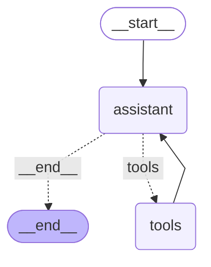

# Day 7 - Session 2: LangGraph Agent & StateGraph Architecture

A comprehensive architectural guide and practical implementation rebuilding the **ReAct Agent** using **LangGraph**:
1. **State & Reducers**: Defining typed shared schemas with state reduction logic (`append_messages`).
2. **Nodes**: Functional units for LLM reasoning (`assistant`) and tool execution (`tools`).
3. **Edges & Conditional Routing**: Standard transitions (`START -> assistant`) and dynamic branch logic (`should_continue`).
4. **Cycles**: Multi-turn agent loops without hardcoded `while` loops.
5. **Checkpointing & Persistence**: Session memory using `MemorySaver` and `thread_id`.
6. **Streaming Intermediate Steps**: Real-time step telemetry via `graph.stream(..., stream_mode='updates')`.
7. **Graph Visualization**: Dual rendering with **Mermaid** and **ASCII**.

---

## 1. LangGraph StateGraph Architecture



### ASCII Graph Representation
```text
        +-----------+         
        | __start__ |         
        +-----------+         
               *              
               *              
               *              
          +-----------+       
          | assistant |       
          +-----------+*      
          .         *         
        ..           **       
       .               *      
+---------+         +-------+ 
| __end__ |         | tools | 
+---------+         +-------+ 
```

---

## 2. Core LangGraph Primitives

### 1. State & Reducers
The `AgentState` is a typed schema flowing through all nodes. Instead of overwriting previous messages, a **reducer** (`append_messages`) merges incremental updates:
```python
def append_messages(existing: List[Any], new_items: List[Any]) -> List[Any]:
    return existing + new_items

class AgentState(TypedDict):
    messages: Annotated[List[Any], append_messages]
    turns_count: int
    current_node: str
```

### 2. Nodes
A node is an isolated callable that accepts `AgentState` and returns a partial state update dictionary:
* **`assistant_node`**: Invokes the LLM with the latest conversation messages. Emits an assistant message containing either `tool_calls` or final text.
* **`tools_node`**: Iterates through requested `tool_calls`, invokes the matching Python tool (`search` or `calculate`), and returns observations with `role="tool"`.

### 3. Conditional Routing & Cycles
In procedural Python, multi-turn tool calling requires managing while-loops and break conditions. In LangGraph, the control flow is declarative:
* **Conditional Edge (`should_continue`)**:
  - If `last_message.tool_calls`: route to `tools`.
  - Else: route to `END`.
* **Cyclic Edge**:
  - `tools` routes unconditionally back to `assistant`.

### 4. Checkpointing & Persistence
LangGraph introduces first-class persistence via Checkpointers (`MemorySaver`, `SqliteSaver`):
```python
graph = builder.compile(checkpointer=MemorySaver())
config = {"configurable": {"thread_id": "session-101"}}
```
Every node transition is checkpointed. Supplying the same `thread_id` in subsequent turns automatically resumes the existing conversation with complete history.

### 5. Streaming Intermediate Steps
Instead of blocking until the final answer, `.stream()` yields step-by-step updates as nodes complete:
```python
for update in graph.stream(input_state, config=config, stream_mode="updates"):
    node_name = list(update.keys())[0]
    # Instantly render intermediate tool calls or observations
```

---

## 3. Directory Layout

```
day_07/session_2/
├── .env                     # Configuration (gemini-3.1-flash-lite)
├── requirements.txt         # Dependencies (langgraph, langchain-openai, grandalf)
├── tools.py                 # search and calculate tool definitions
├── langgraph_agent.py       # StateGraph builder, nodes, conditional edges, MemorySaver
├── main.py                  # Master demonstration script
├── graph_diagram.md         # Rendered Mermaid & ASCII graph visualizer artifact
└── README.md                # Comprehensive architectural documentation
```

---

## 4. Execution & Verification

Run the master demonstration script:
```powershell
.venv\Scripts\python.exe day_07\session_2\main.py
```
