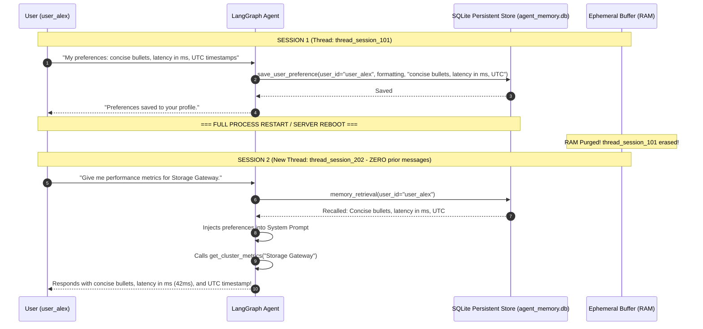

# Day 7 - Session 3: Memory in Agentic AI

A comprehensive architectural guide and practical demonstration of **Multi-Tier Agent Memory**:
1. **Short-Term Conversation Buffer**: Ephemeral session memory scoped by `thread_id`.
2. **Summarisation Memory**: Rolling episodic compression of dialogue turns.
3. **Long-Term Persistent Memory**: Cross-session preferences and user knowledge stored on disk in SQLite (`agent_memory.db`).
4. **Per-User Memory Keys**: Disambiguating global identity (`user_id`) from local conversation threads (`thread_id`).
5. **What Must NEVER Be Persisted**: Security boundaries strictly blocking API keys, tokens, passwords, and PII/PCI.
6. **Just-In-Time Memory Retrieval**: Pre-turn context injection into system prompts.

---

## 1. Multi-Tier Memory Architecture



---

## 2. Core Concepts Deep Dive

### 1. Short-Term vs Long-Term Memory

| Attribute | Short-Term Memory (Buffer) | Long-Term Persistent Memory |
| :--- | :--- | :--- |
| **Scope** | Single conversation thread (`thread_id`). | Global user profile across all sessions (`user_id`). |
| **Storage Medium** | In-memory RAM (`MemorySaver`). | Persistent disk database (`SQLite`, PostgreSQL). |
| **Lifecycle** | Destroyed on process termination or session end. | Indefinite; survives process restarts and redeployments. |
| **Contents** | Turn-by-turn prompt/response exchanges. | Roles, preferences, constraints, learned user traits. |

### 2. What Must NEVER Be Persisted (Security & Compliance)
Persisting the wrong information into long-term agent stores can violate compliance standards (SOC2, GDPR, HIPAA, PCI-DSS) and leak credentials:
* **NEVER Persist**:
  - API keys, access tokens, bearer secrets (`sk-...`, `AIza...`).
  - Passwords, hashes, private encryption keys.
  - Sensitive PII / PCI (Social Security Numbers, Credit Card details).
  - Ephemeral runtime handles (database connection pools, file locks).
* In [`memory_store.py`](file:///c:/Users/harsh/OneDrive/Desktop/Agentic-AI/day_07/session_3/memory_store.py), the `SecuritySanitizer` scans candidate memory keys and values via regex patterns, rejecting forbidden tokens and raising security violations.

### 3. Just-in-Time Memory Retrieval
Instead of dumping an entire database of memories into the prompt (which bloats context and burns tokens), LangGraph uses a dedicated **`memory_retrieval` node**:
1. At the beginning of a turn (`START -> memory_retrieval`), the node inspects `user_id`.
2. It fetches only verified, relevant preferences from SQLite.
3. It formats them into a clean ambient system prompt injection block:
   ```text
   [LONG-TERM USER MEMORY RECALLED for 'user_alex']
   The user has established the following persistent preferences across prior sessions:
     • Output Format: Concise bullet points
     • Latency Unit: Milliseconds (ms)
     • Timezone: UTC
   ```
4. The subsequent `assistant` node reasons with these preferences already loaded in context.

---

## 3. Directory Layout

```
day_07/session_3/
├── .env                       # Configuration (gemini-3.1-flash-lite)
├── requirements.txt           # Dependencies
├── memory_store.py            # SQLite persistent memory engine & SecuritySanitizer
├── agent_memory.db            # Seeded SQLite database on disk
├── tools.py                   # save_user_preference & get_cluster_metrics
├── langgraph_memory_agent.py  # LangGraph StateGraph with memory_retrieval node
├── main.py                    # Master demonstration script (Session 1 -> Restart -> Session 2 Recall)
└── README.md                  # Comprehensive architectural documentation
```

---

## 4. Execution & Verification

Run the master demonstration script:
```powershell
.venv\Scripts\python.exe day_07\session_3\main.py
```
