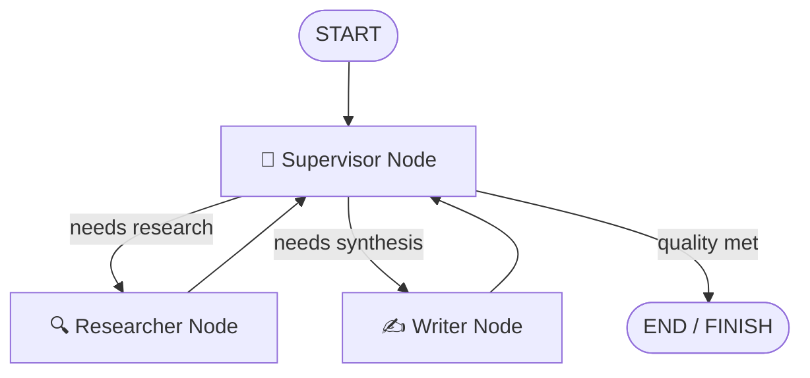
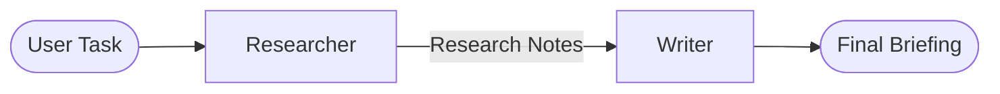
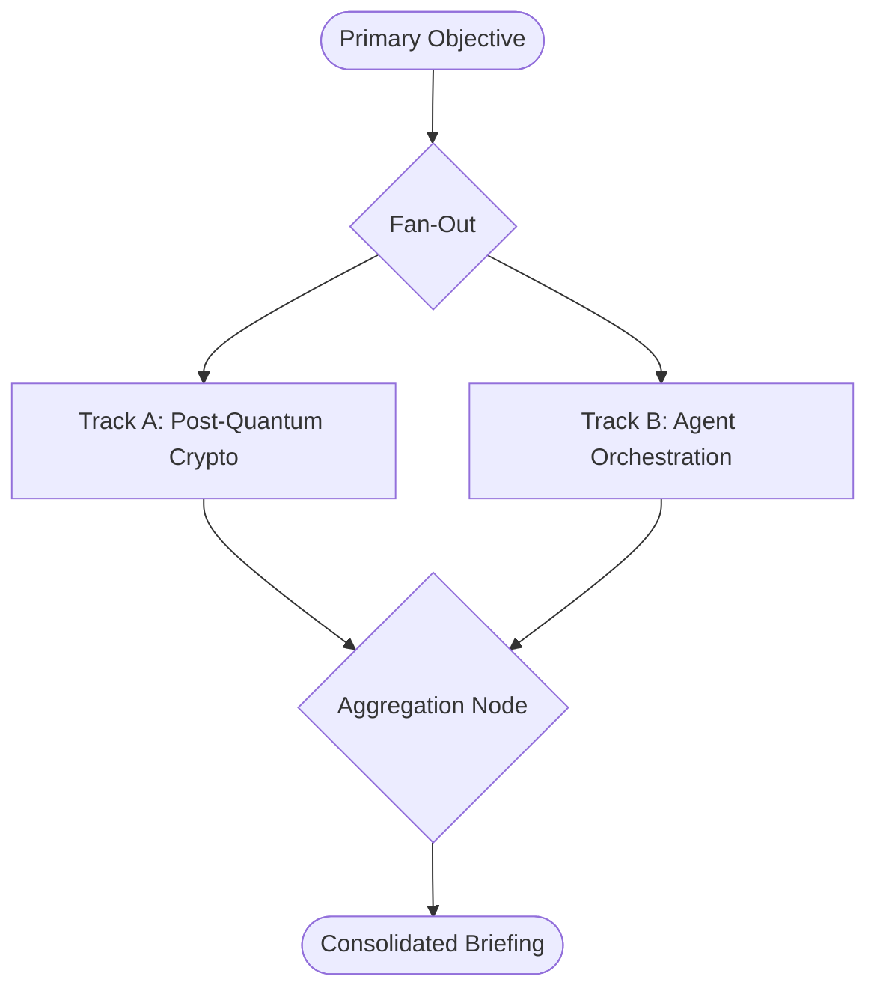

# Day 8 — Session 1: Multi-Agent Systems & Orchestration

This session introduces multi-agent architectural paradigms, orchestrator topologies, state scoping strategies, and the critical operational trade-offs ("The Honest Costs") inherent in distributed agent architectures.

---

## 1. Architectural Patterns Overview

### Pattern A: Supervisor / Orchestrator-Worker
A centralized reasoning agent inspects the global project state and dynamically routes tasks to specialized workers. The supervisor acts as a conductor, evaluating interim worker artifacts and coordinating revisions until quality criteria are satisfied.



### Pattern B: Sequential Handoff
A deterministic linear assembly line ($A \to B \to C$). Ideal for well-understood, single-pass transformations where intermediate self-correction is unneeded.



### Pattern C: Parallel Fan-Out with Aggregation
Independent research or diagnostic inquiries are executed concurrently across parallel threads or workers. An aggregator node reconciles and synthesizes the outputs, cutting wall-clock execution time to $\max(T_1, T_2) + T_{\text{aggregator}}$.



---

## 2. Shared vs Isolated State

| State Paradigm | Mechanism | Advantages | Drawbacks / Risks |
| :--- | :--- | :--- | :--- |
| **Shared State** | Global contract visible to all nodes (`task`, `research_notes`, `draft_report`). | Ensures alignment and seamless handoffs across nodes. | Context pollution; risk of unintentional overwrites; growing payload size. |
| **Isolated State** | Private scratchpads maintained internally by individual workers. | Clean reasoning; worker prompts not bogged down by raw HTTP logs or tool payloads. | Requires deliberate extraction and structured serialization into shared state. |

---

## 3. The Honest Costs of Multi-Agent Systems

Multi-agent architectures are frequently over-hyped. Production deployments must account for three compounding penalties:

### 1. Latency Multiplication
Every sequential agent turn introduces an independent LLM inference round-trip ($3\text{s} - 8\text{s}$ per turn).
$$T_{\text{total}} = \sum_{i=1}^N T_{\text{node}_i}$$
A single-prompt agent takes $\approx 3.5\text{s}$, whereas a 5-step supervisor loop takes $\approx 20\text{s} - 45\text{s}$.

### 2. Error Compounding
If each agent has an independent success probability $p \in (0, 1)$, the probability that an $N$-agent pipeline succeeds without a single failure drops exponentially:
$$P_{\text{overall}} = \prod_{i=1}^N p_i = p^N$$
$$\text{Failure Risk} = 1 - p^N$$

| Agents in Chain ($N$) | Single Step Accuracy ($p=0.90$) | Overall System Success | Single Step Accuracy ($p=0.80$) | Overall System Success |
| :---: | :---: | :---: | :---: | :---: |
| **1** | $90.0\%$ | **$90.0\%$** | $80.0\%$ | **$80.0\%$** |
| **2** | $90.0\%$ | **$81.0\%$** | $80.0\%$ | **$64.0\%$** |
| **3** | $90.0\%$ | **$72.9\%$** | $80.0\%$ | **$51.2\%$** |
| **4** | $90.0\%$ | **$65.6\%$** | $80.0\%$ | **$40.9\%$** |
| **5** | $90.0\%$ | **$59.0\%$** | $80.0\%$ | **$32.8\%$** |

*Key Takeaway: In a 5-agent pipeline operating at 80% per-turn reliability, the system is twice as likely to fail as it is to succeed without explicit recovery guardrails.*

### 3. Token Bloat ($O(N^2)$ vs $O(N)$)
When systems naïvely share full conversational message histories with every worker, token consumption grows quadratically:
$$\text{Tokens}_{\text{shared}} = \sum_{i=1}^N (i \times K) = \frac{N(N+1)}{2} K \quad (O(N^2))$$
By contrast, isolating scratchpads and passing only finalized state artifacts preserves linear $O(N)$ cost scaling.

---

## 4. File Index

- [`supervisor_graph.py`](file:///c:/Users/harsh/OneDrive/Desktop/Agentic-AI/day_08/session_1/supervisor_graph.py): LangGraph StateGraph implementing Supervisor $\to$ Worker conditional routing.
- [`agents.py`](file:///c:/Users/harsh/OneDrive/Desktop/Agentic-AI/day_08/session_1/agents.py): `SupervisorAgent`, `ResearcherAgent`, and `WriterAgent` implementations.
- [`state.py`](file:///c:/Users/harsh/OneDrive/Desktop/Agentic-AI/day_08/session_1/state.py): `MultiAgentState` schema and state isolation helpers.
- [`patterns_comparison.py`](file:///c:/Users/harsh/OneDrive/Desktop/Agentic-AI/day_08/session_1/patterns_comparison.py): Implementation of Sequential Handoff, Parallel Fan-Out, and Honest Costs models.
- [`tools.py`](file:///c:/Users/harsh/OneDrive/Desktop/Agentic-AI/day_08/session_1/tools.py): Domain knowledge base for PQC and multi-agent systems.
- [`main.py`](file:///c:/Users/harsh/OneDrive/Desktop/Agentic-AI/day_08/session_1/main.py): Master test runner and end-to-end verification.

---

## 5. Execution

Run the master test suite:

```bash
.venv\Scripts\python.exe day_08\session_1\main.py
```
