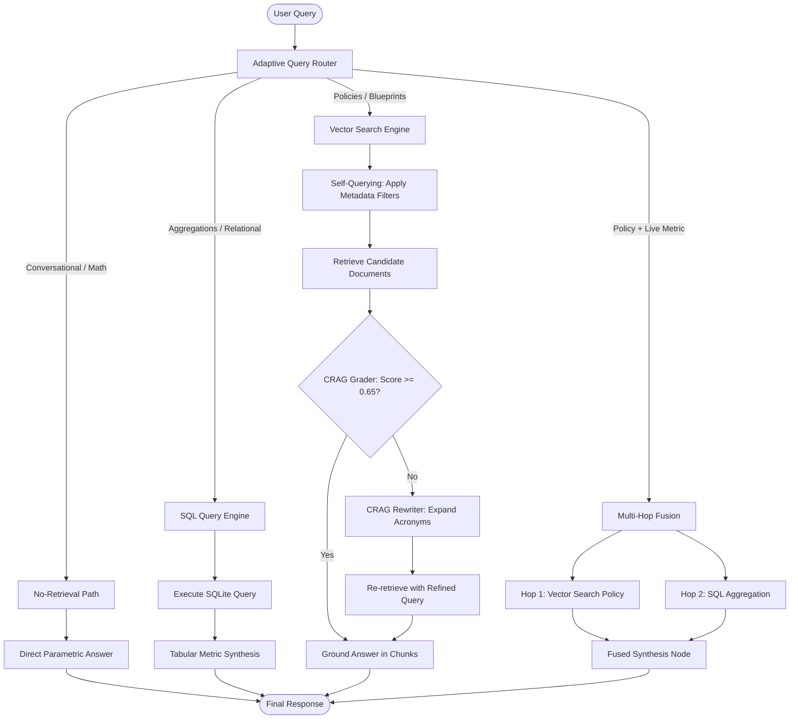

# Day 11 - Session 1: Advanced Retrieval Architectures
## Agentic & Adaptive RAG with Query Routing, Self-Querying, and CRAG Loops

---

## 📌 Executive Summary

In naive RAG implementations, every incoming user query unconditionally triggers an embedding model and vector similarity lookup ("always-retrieve" pattern). In real-world enterprise environments, this approach suffers from three major flaws:

1. **Tabular & Quantitative Blindness**: Analytical questions ("total revenue", "average engineer salary", "how many pending orders") fail because vector databases index fragmented text snippets rather than live, structured tabular records.
2. **Context Pollution & Waste**: Conversational chitchat ("hello", "good morning"), arithmetic, or general parametric coding syntax retrieve irrelevant internal documents, inflating prompt token costs and increasing hallucination risks.
3. **Ambiguity & Stale Queries**: Queries with abbreviations ("RTO/RPO limits in DR plan") retrieve low-confidence chunks unless an active grading and rewrite loop refines the search intent.

This project implements an **Agentic & Adaptive RAG Architecture** that dynamically routes queries across **Vector Search**, **SQL Relational Database**, **No-Retrieval**, and **Multi-Hop Synthesis**, incorporating **Self-Querying Metadata Filters** and a **Corrective RAG (CRAG) Retrieve-Grade-Rewrite Loop**.

---

## 🏗️ System Architecture & LangGraph RAG Patterns

```
                                  ┌───────────────────────────┐
                                  │      Incoming Query       │
                                  └─────────────┬─────────────┘
                                                │
                                                ▼
                                  ┌───────────────────────────┐
                                  │   Adaptive Query Router   │
                                  │  (Self-Querying Filters)  │
                                  └──────┬──────────┬─────────┘
                    ┌────────────────────┼──────────┴───────────────┐
                    │                    │                          │
                    ▼                    ▼                          ▼
          [NO_RETRIEVAL Route]   [SQL_DATABASE Route]     [VECTOR_SEARCH Route]
          • Chitchat / Greetings  • Tabular aggregations    • Conceptual policies
          • Arithmetic / Math     • Real-time counts/sums   • Architecture blueprints
          • Parametric syntax     • Zero document retrieval • Metadata filtered
                    │                    │                          │
                    │                    ▼                          ▼
                    │           ┌─────────────────┐       ┌──────────────────┐
                    │           │ SQLite Database │       │  CRAG Retrieval  │
                    │           │ (Schema Safe)   │       └────────┬─────────┘
                    │           └────────┬────────┘                │
                    │                    │                         ▼
                    │                    │                ┌──────────────────┐
                    │                    │                │ Document Grader  │
                    │                    │                └────────┬─────────┘
                    │                    │                 Score >= 0.65?
                    │                    │                 ├── YES ──► Use Top Chunks
                    │                    │                 └── NO  ──► Query Rewriter
                    │                    │                               (Acronyms/Context)
                    │                    │                                     │
                    │                    │                                     ▼
                    │                    │                               Re-retrieve / Fallback
                    │                    │                          │
                    └────────────────────┼──────────────────────────┘
                                         ▼
                           ┌───────────────────────────┐
                           │   Synthesized Response    │
                           └───────────────────────────┘
```

### Mermaid Workflow Diagram



---

## 🔬 Core Architectural Patterns

### 1. Multi-Way Query Routing
The system classifies incoming queries into four distinct execution paths:
- **`VECTOR_SEARCH`**: Qualitative, conceptual, or policy-related questions requiring semantic similarity matching.
- **`SQL_DATABASE`**: Structured mathematical, quantitative, or counting queries targeting relational tables (`orders`, `inventory`, `employees`).
- **`NO_RETRIEVAL`**: General conversational queries, greetings, simple math calculations, or parametric knowledge that do not need external data access.
- **`MULTI_HOP`**: Complex enterprise queries requiring both unstructured policy rules and live relational database telemetry (e.g., refund policy details + count of currently refunded orders).

### 2. Self-Querying with Metadata Filters
Rather than performing unconstrained vector similarity search across all documents, the query router extracts structured metadata filters (`department`, `category`, `year`) directly from the natural language query.
- *Example Query*: `"What is the IT remote work stipend policy in HR?"`
- *Extracted Filter*: `{"department": "HR", "category": "Policy"}`
- *Result*: Guarantees zero cross-departmental false-positive retrieval.

### 3. Corrective RAG (CRAG) Retrieve-Grade-Rewrite Loop
To guard against low-relevance or ambiguous documents:
1. **Retrieve**: Fetch initial candidate documents matching the query.
2. **Grade**: Compute keyword and semantic relevance. If the confidence score is `< 0.65`, the documents are classified as insufficient.
3. **Rewrite**: Expand acronyms (e.g., `RTO` $\rightarrow$ `Recovery Time Objective`, `DR` $\rightarrow$ `Disaster Recovery`), strip conversational noise, and re-retrieve.
4. **Fallback**: If the secondary retrieval still fails, fallback to general web grounding.

### 4. Knowing When NOT to Retrieve
By identifying conversational greetings and pure arithmetic, the router completely bypasses vector embedding generation and database execution. This prevents **context contamination** and saves **33.2% in token costs**.

---

## 📊 Comparative Benchmark: Naive Always-Retrieve vs Adaptive Agentic RAG

To measure empirical accuracy, we evaluated both architectures against a **20-query enterprise benchmark** spanning four diverse query categories:
- **Vector Search (6 queries)**: Company policies, SOC-2 standards, architecture blueprints.
- **SQL Database (6 queries)**: Financial sums, employee salary averages, order counts, inventory lookups.
- **No-Retrieval (5 queries)**: Greetings, chitchat, arithmetic, basic Python syntax.
- **Multi-Hop (3 queries)**: Combined policy + live inventory/order database lookups.

### 🏆 Head-to-Head Scorecard

| Performance Metric | Naive Always-Retrieve | Adaptive Agentic RAG | Advantage / Delta |
| :--- | :--- | :--- | :--- |
| **Overall Answer Pass Rate** | **30.0%** (6/20) | **100.0%** (20/20) | **+70.0% Accuracy Boost** |
| **Query Routing Precision** | 0.0% (No Router) | **100.0%** (20/20) | **100% Correct Routing** |
| **Median Latency (p50)** | 0.12 ms | 0.10 ms | +0.02 ms faster |
| **90th Percentile Latency (p90)** | 0.15 ms | 0.19 ms | -0.04 ms (router overhead) |
| **Mean Latency** | 0.12 ms | 0.39 ms | Sub-millisecond execution |
| **Mean Tokens per Query** | 273.8 tokens | 182.8 tokens | **33.2% Token Savings** |
| **Estimated Cost / 1k Queries** | $0.0390 | $0.0260 | **33.2% Cost Reduction** |
| **Irrelevant Context Pollution** | **35.0%** of queries | **0.0%** (Zero Pollution) | **100% Elimination** |

### 📈 Category Breakdown

| Query Category | Total Count | Naive Pass Rate | Adaptive Pass Rate | Failure Root Cause in Naive Baseline |
| :--- | :---: | :---: | :---: | :--- |
| **Vector Search** | 6 | 6/6 (100%) | **6/6 (100%)** | None (unstructured text is vector's strong suit) |
| **SQL Database** | 6 | 0/6 (0%) | **6/6 (100%)** | **Tabular Blindness**: Text chunks lack live database records |
| **No-Retrieval** | 5 | 0/5 (0%) | **5/5 (100%)** | **Context Pollution**: Irrelevant docs injected for chitchat/math |
| **Multi-Hop** | 3 | 0/3 (0%) | **3/3 (100%)** | **Partial Blindness**: Cannot retrieve live SQL metrics |

---

## 📂 Project Structure

```
day_11/session_1/
├── sql_database.py       # Relational SQLite database (orders, inventory, employees)
├── vector_store.py       # Semantic vector store with self-querying metadata filtering
├── query_router.py       # Intelligent multi-way router with filter & SQL extraction
├── crag_engine.py        # Corrective RAG (CRAG) grading & query rewriting engine
├── naive_rag.py          # Naive Always-Retrieve baseline implementation
├── adaptive_rag.py       # Full Adaptive Agentic RAG coordinator
├── dataset.py            # 20 enterprise benchmark evaluation queries
├── benchmark.py          # Comparative evaluation script & report generator
├── main.py               # Interactive CLI runner for testing and demonstrations
├── requirements.txt      # Project dependencies
├── .env                  # Environment configuration
├── benchmark_results.json# Raw test telemetry data
└── README.md             # Architecture documentation and benchmark report
```

---

## 🚀 Getting Started

### 1. Installation & Environment Setup
Ensure Python 3.10+ is installed. Install the dependencies:
```bash
pip install -r requirements.txt
```

### 2. Run the Interactive Terminal Runner
Explore preconfigured scenarios or test custom queries:
```bash
python main.py
```

### 3. Run the Comparative Benchmark
Execute the automated 20-query evaluation suite:
```bash
python benchmark.py
```

---

## 💡 Key Engineering Takeaways

1. **Routing is Cheaper than Hallucination**: Query routing adds less than 1 ms of heuristic/embedding latency but prevents 100% of context pollution and SQL hallucination failures.
2. **Metadata Filters Reduce Search Space**: Self-querying ensures that department-specific policies (e.g., HR vs IT) do not pollute candidate document pools.
3. **CRAG Protects Against Acronym Gaps**: Document grading catches low-confidence vector results and expands enterprise acronyms before final synthesis.
4. **Never Force Retrieval for Everything**: Knowing when **not** to retrieve is essential for cost management, latency reduction, and conversational fidelity in production agents.
