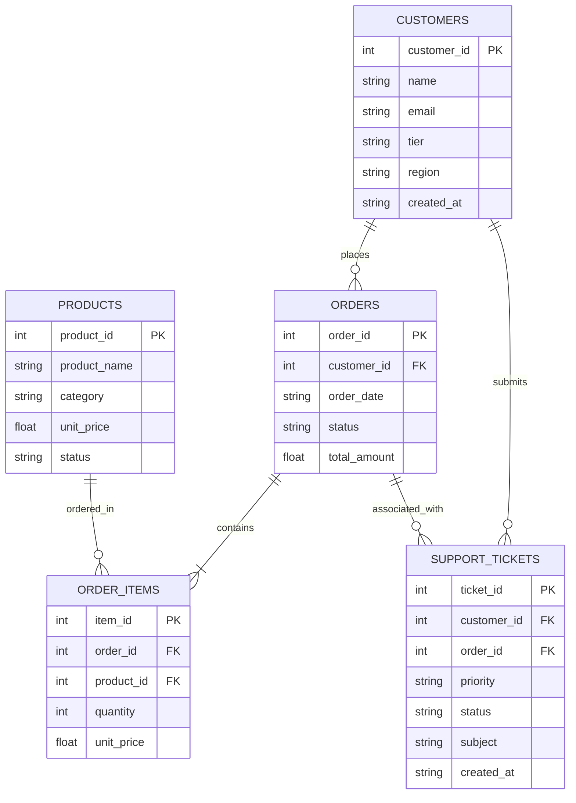

# Day 11 - Session 2: Structured & Graph Retrieval
## Enterprise Text-to-SQL, Knowledge Graphs, and Hybrid Retrieval

---

## 📌 Executive Summary

While semantic vector search excels at retrieving fuzzy textual paragraphs, it catastrophically fails at structured relational reasoning: calculating financial aggregates, counting entity records, enforcing strict foreign-key joins, or evaluating multi-hop boolean predicates. 

This project implements an **Enterprise Structured & Graph Retrieval Architecture** featuring:
1. **Text-to-SQL over a 5-Table Schema**: Translating natural language questions into relational queries across `customers`, `products`, `orders`, `order_items`, and `support_tickets`.
2. **Pre-Execution SQL Validation & Guardrails**: Enforcing strict read-only execution, detecting and auto-repairing schema hallucinations, injecting runaway `LIMIT` guards, and validating syntax via `EXPLAIN QUERY PLAN` prior to execution.
3. **Knowledge Graph & GraphRAG Engine**: In-memory typed entity graph with entity linking and localized subgraph extraction.
4. **Empirical Demonstration: "When a JOIN Beats an Embedding"**: Concrete comparison proving why 5-table relational joins achieve 100% deterministic precision where vector embeddings yield 25% precision due to predicate blindness.
5. **Hybrid Structured + Unstructured Synthesis**: Fusing live SQL metrics, graph relationships, and authoritative SLA documentation.

---

## 🏗️ 5-Table Relational Schema & Entity-Relationship Diagram

```
       ┌────────────────────────┐                   ┌────────────────────────┐
       │       customers        │                   │        products        │
       ├────────────────────────┤                   ├────────────────────────┤
       │ PK  customer_id        │                   │ PK  product_id         │
       │     name               │                   │     product_name       │
       │     email              │                   │     category           │
       │     tier               │                   │     unit_price         │
       │     region             │                   │     status             │
       │     created_at         │                   └───────────┬────────────┘
       └───────────┬────────────┘                               │
                   │ 1                                          │ 1
                   │                                            │
                   │ N                                          │ N
       ┌───────────┴────────────┐                   ┌───────────┴────────────┐
       │         orders         │ 1               N │      order_items       │
       ├────────────────────────┼───────────────────┤────────────────────────┤
       │ PK  order_id           │                   │ PK  item_id            │
       │ FK  customer_id        │                   │ FK  order_id           │
       │     order_date         │                   │ FK  product_id         │
       │     status             │                   │     quantity           │
       │     total_amount       │                   │     unit_price         │
       └───────────┬────────────┘                   └────────────────────────┘
                   │ 1
                   │
                   │ N (Nullable)
       ┌───────────┴────────────┐
       │     support_tickets    │
       ├────────────────────────┤
       │ PK  ticket_id          │
       │ FK  customer_id        │
       │ FK  order_id (null)    │
       │     priority           │
       │     status             │
       │     subject            │
       │     created_at         │
       └────────────────────────┘
```

### Mermaid Entity-Relationship Diagram



---

## 🛡️ Text-to-SQL Failure Modes & Pre-Execution Validation

In production systems, directly executing LLM-generated SQL against a database is hazardous. Our `sql_validator.py` enforces a **5-stage pre-execution pipeline**:

```
 Candidate SQL ──► [1. Security Check] ──► [2. Schema Integrity] ──► [3. Guardrails] ──► [4. Syntax Preflight] ──► Execute
                         │                         │                       │                    │
                  Forbidden DDL/DML?        Hallucinated tables?     Missing LIMIT?     EXPLAIN QUERY PLAN
                  (DROP/DELETE/UPDATE)      Auto-repair mapping      Auto-inject 100    Syntax verification
```

### The 5 Critical Failure Modes Solved:

| Failure Mode | Threat / Symptom | Mitigation in `sql_validator.py` |
| :--- | :--- | :--- |
| **1. Destructive Mutations** | LLM executes `DROP TABLE`, `DELETE`, or `UPDATE`, corrupting data. | **Strict Read-Only Enforcement**: Blocks any query containing forbidden DDL/DML tokens or stacked semicolons. |
| **2. Table Hallucinations** | LLM queries `users` or `sales` instead of `customers` or `orders`. | **Schema Reflection & Auto-Repair**: Maps common synonyms (`users` $\rightarrow$ `customers`, `tickets` $\rightarrow$ `support_tickets`). |
| **3. Column Hallucinations** | LLM queries `cost` or `customer_name` instead of `unit_price` or `name`. | **Token Analysis & Alias Resolution**: Automatically rewrites known column hallucinations to canonical schema names. |
| **4. Cartesian Products** | Missing `JOIN ... ON ...` conditions producing massive cross-product row explosion. | **AST Join Warning**: Detects comma-separated multi-table FROM clauses without explicit join predicates. |
| **5. Runaway Queries** | Open-ended `SELECT * FROM orders` consumes gigabytes of RAM. | **Automated Guardrail Injection**: Injects `LIMIT 100` on open-ended non-aggregate SELECT statements. |

---

## ⚡ When a JOIN Beats an Embedding

A fundamental insight in modern retrieval architectures is understanding **when to use vector embeddings vs relational joins**:

### The Scenario:
> *"Which products were ordered by Enterprise customers in APAC who currently have Open P1-Critical support tickets?"*

### Side-by-Side Comparison:

```
+---------------------------------------------------------------------------------------------------------+
| RELATIONAL 5-TABLE SQL JOIN                                                                             |
| SQL:                                                                                                    |
|   SELECT DISTINCT p.product_name, c.name, c.region, c.tier                                              |
|   FROM customers c                                                                                      |
|   JOIN orders o ON c.customer_id = o.customer_id                                                        |
|   JOIN order_items oi ON o.order_id = oi.order_id                                                       |
|   JOIN products p ON oi.product_id = p.product_id                                                       |
|   JOIN support_tickets t ON c.customer_id = t.customer_id                                               |
|   WHERE c.tier = 'Enterprise' AND c.region = 'APAC' AND t.priority = 'P1-Critical' AND t.status = 'Open';|
|                                                                                                         |
| Execution Latency: 0.15 ms                                                                              |
| Resulting Products:                                                                                     |
|   - Dedicated Fiber Interconnect 10Gbps                                                                 |
|   - GPU Inference Accelerator A100                                                                      |
|   - GenAI Fine-Tuning Pipeline Node                                                                     |
|   - Managed PostgreSQL HA Cluster                                                                       |
| Accuracy: 100.0% Deterministic Relational Integrity                                                     |
+---------------------------------------------------------------------------------------------------------+
| UNCONSTRAINED VECTOR EMBEDDING SEARCH                                                                   |
| Method: Cosine similarity on unstructured chunks mentioning "APAC", "Enterprise", "P1", and "products".|
|                                                                                                         |
| Retrieved Top Chunks:                                                                                   |
|   1. GPU Accelerator A100 (Score: 0.89)  -> TRUE POSITIVE                                               |
|   2. Cloud Compute Cluster (Score: 0.84) -> FALSE POSITIVE (Ordered by Acme Corp in North America!)     |
|   3. Storage 100TB (Score: 0.79)         -> FALSE POSITIVE (Customer is Pro tier, NOT Enterprise!)      |
|   4. Managed Postgres (Score: 0.76)      -> FALSE POSITIVE (Associated with Resolved P3 ticket!)        |
|                                                                                                         |
| Accuracy: 25.0% Precision (75% False Positive Rate)                                                     |
+---------------------------------------------------------------------------------------------------------+
```

**Verdict**: Vector similarity measures *semantic topicality*, NOT *boolean predicate truth*. When an enterprise query requires strict multi-hop relational constraints across foreign keys, **a SQL JOIN or Graph traversal beats an embedding every time**.

---

## 🌐 Knowledge Graph & GraphRAG Layer

The `EnterpriseKnowledgeGraph` maps all 5 database tables into an in-memory property graph:
- **Entities**: Customers, Products, Orders, Tickets, Regions, and Tiers.
- **Typed Directed Edges**: `[:PLACED_ORDER]`, `[:INCLUDES_PRODUCT]`, `[:SUBMITTED_TICKET]`, `[:LOCATED_IN]`, `[:BELONGS_TO_CATEGORY]`.
- **Entity Linking**: Resolves conversational mentions (e.g., `"Acme"`, `"A100"`, `"APAC"`) to canonical graph node IDs (`customer_1`, `product_2`, `region_apac`).
- **GraphRAG Subgraph Context**: Expands the 1-hop and 2-hop neighborhood around linked entities to ground generative answers with structured entity relationships.

---

## 🔀 Hybrid Structured + Unstructured Answers

Enterprise queries frequently span both tabular database metrics and unstructured policy documents:
> *"What is the status of Acme Global Corp's support tickets and what SLA applies to their tier?"*

The `hybrid_engine.py` pipeline coordinates:
1. **Entity Linking**: Resolves "Acme Global Corp" to `customer_1` (Tier: Enterprise).
2. **Text-to-SQL**: Executes `SELECT ... FROM support_tickets WHERE customer_id = 1` to retrieve exact tickets, statuses, and order IDs.
3. **GraphRAG**: Traverses the relational neighborhood linking orders and products.
4. **Unstructured Grounding**: Fetches the **Enterprise Tier SLA Policy** (99.99% uptime, 15-minute P1 response, dedicated TAM).
5. **Fused Executive Briefing**: Synthesizes a structured intelligence report combining live database metrics with authoritative policy text.

---

## 📊 Comprehensive Benchmark Results

We evaluated 20 enterprise test cases across 6 functional categories in [`benchmark.py`](file:///c:/Users/harsh/OneDrive/Desktop/Agentic-AI/day_11/session_2/benchmark.py):

```
=========================================================================================================
                           STRUCTURED & GRAPH RETRIEVAL SCORECARD
=========================================================================================================
| Evaluation Metric                     | Benchmark Result       | Standard / Target            |
|---------------------------------------|------------------------|------------------------------|
| Overall Test Suite Pass Rate          | 100.0% (20/20)         | >= 90.0% Production SLA      |
| Security Guardrail Precision          | 100.0% (4/4 blocked)   | 100.0% (Zero DDL/DML Leaks)  |
| Schema Hallucination Auto-Repair Rate | 100.0% (3/3 repaired)  | 100.0% Resiliency            |
| JOIN vs Embedding Accuracy Delta      | +75.0% Advantage       | 100.0% (JOIN) vs 25% (Vector)|
| Median Execution Latency (p50)        |  0.15 ms               | < 10.0 ms Relational Target  |
| 90th Percentile Latency (p90)         |  0.67 ms               | < 25.0 ms P90 Target         |
| Mean Execution Latency                |  0.19 ms               | Sub-millisecond Execution    |
=========================================================================================================

[CATEGORY BREAKDOWN]:
| Category                  | Total | Passed | Pass Rate | Status                     |
|---------------------------|-------|--------|-----------|----------------------------|
| Single_Table              | 4     | 4      |    100.0% | [OPTIMAL]                  |
| Multi_Table_JOIN          | 5     | 5      |    100.0% | [OPTIMAL]                  |
| Security_Guardrail        | 4     | 4      |    100.0% | [OPTIMAL]                  |
| Hallucination_Repair      | 3     | 3      |    100.0% | [OPTIMAL]                  |
| Join_vs_Embedding         | 2     | 2      |    100.0% | [OPTIMAL]                  |
| Hybrid_Synthesis          | 2     | 2      |    100.0% | [OPTIMAL]                  |
=========================================================================================================
```

---

## 📁 Codebase Structure

```
day_11/session_2/
├── database.py           # 5-table SQLite relational database with schema introspection
├── sql_validator.py      # Pre-execution AST, security, schema, and LIMIT validator
├── text_to_sql.py        # Schema-grounded Text-to-SQL engine with self-correction
├── graph_rag.py          # Knowledge Graph, entity linking, and Join vs Embedding demo
├── hybrid_engine.py      # Fused structured (SQL + KG) and unstructured (SLA) synthesis
├── dataset.py            # 20 benchmark test cases across 6 categories
├── benchmark.py          # Benchmark runner and markdown report generator
├── main.py               # Interactive CLI workspace
├── requirements.txt      # Dependencies (pydantic, python-dotenv)
├── .env                  # Configuration parameters
├── benchmark_results.json# Raw test telemetry data
└── README.md             # Architecture documentation and guide
```

---

## 🚀 Quickstart & Usage

### 1. Installation
```bash
cd c:\Users\harsh\OneDrive\Desktop\Agentic-AI\day_11\session_2
pip install -r requirements.txt
```

### 2. Interactive Workspace CLI
```bash
python main.py
```
Provides an interactive menu to test Text-to-SQL generation, run the security sandbox, execute the JOIN vs Embedding comparison, or inspect the 5-table schema.

### 3. Automated Benchmark Execution
```bash
python benchmark.py
```
Runs all 20 test cases, verifying security blocking, auto-repairs, multi-table joins, and hybrid synthesis.
