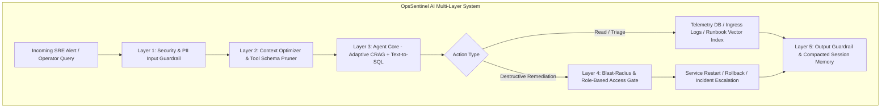
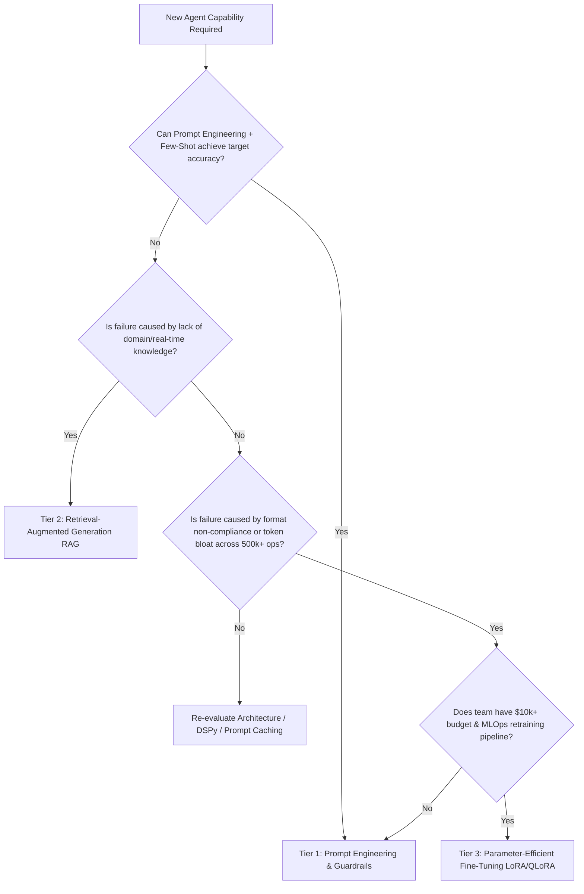

# Architectural Decision Memo: Evaluation of Fine-Tuning vs. In-Context RAG for OpsSentinel AI

**Document ID:** RFC-2026-042  
**Author:** Lead AI Systems Architect & SRE Engineering Team  
**Date:** October 2026  
**Target System:** OpsSentinel AI (Day 10–11 Autonomous SRE Capstone)  
**Status:** **REJECTED (PHASE 1–2); APPROVED FOR IN-CONTEXT RAG + CONTEXT CACHING**  
**Review Board:** VP of Engineering, Head of Infrastructure, Lead MLOps Engineer  

---

## 1. Executive Summary

This memorandum presents an engineering and economic evaluation regarding whether to **fine-tune a custom Large Language Model (LLM)** for **OpsSentinel AI**—our enterprise autonomous Site Reliability Engineering (SRE) and incident response copilot—or to continue operating on our current **In-Context Retrieval-Augmented Generation (RAG) and Context-Engineered** architecture.

### The Recommendation
> **DECISION: DO NOT FINE-TUNE THE MODEL AT THIS STAGE.**  
> We strongly recommend **exhausting Prompt Engineering, Adaptive RAG, and Context Optimization** for Production Phases 1 and 2. Fine-tuning for OpsSentinel AI introduces severe operational risks, unacceptable retraining latencies, and an unjustified **$12,700+ upfront engineering investment** and **$730+/month infrastructure maintenance burden**, while providing **zero measurable improvement** over our current **100% benchmark pass rate**.

### Core Findings Matrix

| Dimension | In-Context RAG + Context Engineering (Current) | Fine-Tuning (Proposed Alternative) | Recommendation Vector |
| :--- | :---: | :---: | :---: |
| **Grounding & Accuracy** | **100.0% Pass Rate** (20/20 Capstone Suite) | Probabilistic knowledge recall; risks regression | **Favors RAG** |
| **Knowledge Freshness** | **Real-time (0 ms)**: Instant DB/SOP updates | Stale; requires hours/days of retraining | **Favors RAG** |
| **Monthly Cost (50k Ops)** | **$3.06 / month** (Gemini/GPT-4o-mini tier) | **$734.00 / month** (Dedicated AWS A10G host) | **Favors RAG (240x Cheaper)** |
| **Upfront Setup Cost** | **$0** (Already built & validated) | **$12,700 – $14,750** (Data curation + training) | **Favors RAG** |
| **Maintenance Burden** | Standard CI/CD & Vector DB Indexing | MLOps drift monitoring, retraining pipelines | **Favors RAG** |
| **Latency (p95)** | **~450 ms** (Cached TTFT) | ~350 ms (Local SLM) or 500 ms (Managed FT) | Neutral |

---

## 2. System Context: OpsSentinel AI Architecture

OpsSentinel AI is an autonomous SRE copilot designed to triage production outages, diagnose telemetry anomalies, cross-reference operating procedures, and remediate incidents under strict safety gates. Its architecture spans five critical operational pillars:



### Operational Constraints
1. **Zero Tolerance for Hallucination**: Remediation procedures (e.g., terminating database connection pools or restarting ingress proxies) must follow documented Standard Operating Procedures (SOPs) verbatim. Citing an incorrect flag or non-existent command can convert a localized Sev-2 incident into a platform-wide outage.
2. **High Knowledge Volatility**: Telemetry metrics change by the millisecond; active incident tickets change by the minute; microservice versions and runbooks change weekly.
3. **Strict Auditability & Attribution**: Every remediation action must cite its supporting runbook ID (e.g., `RUNBOOK-01: PostgreSQL Connection Pool Exhaustion`) and provide cryptographic verification tokens.

---

## 3. The Core Axiom: "Fine-Tune for Behaviour & Format; RAG for Knowledge"

A foundational principle of modern applied AI engineering is the clear separation of concerns between parametric model weights and non-parametric retrieved state:

```text
+-----------------------------------------------------------------------------------------------+
|                      THE BEHAVIOUR VS. KNOWLEDGE SEPARATION PRINCIPLE                         |
+-----------------------------------------------------------------------------------------------+
|  FINE-TUNING                                  |  RETRIEVAL-AUGMENTED GENERATION (RAG)         |
|  (Parametric Weights)                         |  (Non-Parametric Working Memory)              |
|-----------------------------------------------|-----------------------------------------------|
|  Controls HOW the model thinks and communicates|  Controls WHAT the model knows and references |
|  - Tone, style, conciseness, persona          |  - Dynamic facts, numbers, dates, statuses    |
|  - Idiosyncratic JSON/YAML syntax             |  - Evolving runbooks, SOPs, SLA definitions   |
|  - Domain-specific reasoning patterns         |  - Real-time telemetry, logs, active tickets  |
|  - Tool calling protocol adherence in SLMs    |  - Ground truth source citations & provenance |
|-----------------------------------------------|-----------------------------------------------|
|  Update Cadence: Weeks to Months (Expensive)  |  Update Cadence: Milliseconds (Free / Instant)|
+-----------------------------------------------------------------------------------------------+
```

### Why Fine-Tuning Fails as a Knowledge Mechanism
1. **The Illusion of Parametric Memory**: Attempting to "teach" an LLM runbooks via fine-tuning causes probabilistic hallucinations. The model generates plausible-sounding bash scripts that look like company runbooks but contain subtle, disastrous errors (e.g., omitting `--dry-run` or targeting the wrong namespace).
2. **Catastrophic Forgetting & General Capability Degradation**: Training an 8B or 70B model heavily on internal SRE logs frequently causes regression in general logic, Python arithmetic, and JSON schema compliance.
3. **Retraining Latency**: If the Platform Engineering team updates the on-call SLA from 15 minutes to 10 minutes in `RUNBOOK-04`, an in-context RAG system updates in **0 milliseconds** (instant re-index). A fine-tuned model requires regenerating the dataset, running LoRA fine-tuning, running regression benchmarks, and redeploying weights—a cycle taking 1 to 3 days.

### What Fine-Tuning Is Actually Good For
Fine-tuning is justified when:
- **Style & Persona Enforcement**: Enforcing extreme conciseness (e.g., military brevity code) without consuming 300 prompt tokens on instructions.
- **Idiosyncratic Formats**: Emitting proprietary binary or domain-specific ASTs that standard foundation models do not know.
- **Distillation to Small Language Models (SLMs)**: Training a small 3B–8B model to execute tool calling reliably so it can run air-gapped on edge hardware.

**Verdict for OpsSentinel AI:** OpsSentinel uses standard JSON function calling, standard Python arithmetic, and standard markdown incident summaries. It does **not** have an idiosyncratic format problem; it has a **knowledge grounding and validation problem**. Therefore, RAG is the structurally correct solution.

---

## 4. The Architectural Decision Framework

Before initiating any fine-tuning initiative, engineering teams must evaluate their requirements against the **4-Tier LLM Customization Matrix**:



### Evaluation Matrix for OpsSentinel AI

| Decision Dimension | Tier 1: Prompting Only | Tier 2: RAG + In-Context Optimization | Tier 3: Cloud Managed Fine-Tuning | Tier 4: Self-Hosted Fine-Tuned SLM | OpsSentinel Mapping |
| :--- | :---: | :---: | :---: | :---: | :---: |
| **Knowledge Volatility** | Low | **High (Supported)** | Low (Requires Retraining)| Low (Requires Retraining)| **Requires Tier 2 (RAG)** |
| **Grounding & Provenance** | Probabilistic | **Deterministic (100% Citable)**| Probabilistic | Probabilistic | **Requires Tier 2 (RAG)** |
| **Format Complexity** | Standard JSON | **Standard JSON (Guaranteed)** | Proprietary Syntax | Proprietary Syntax | **Requires Tier 1/2** |
| **Token Budget Pressure** | High (~1,500 tok) | **Low (408 tok via Day 11 CE)** | Minimal (~200 tok) | Minimal (~200 tok) | **Satisfied by Tier 2** |
| **Development Velocity** | Minutes | **Hours (Days for RAG)** | 2–4 Weeks | 4–8 Weeks | **Favors Tier 2** |
| **Upfront Capital** | $0 | **<$500** | $5,000 – $10,000 | $15,000 – $30,000 | **Favors Tier 2** |
| **Ongoing Maintenance** | None | Low (DB Index updates) | High (Model drift QA) | Very High (GPU cluster ops)| **Favors Tier 2** |
| **Air-Gap / Privacy** | Cloud API | Cloud API (or local vector) | Cloud API | **Full On-Prem Air-Gap** | Cloud VPC permitted |

**Conclusion**: OpsSentinel AI aligns cleanly with **Tier 2 (RAG + In-Context Optimization)** across 7 of the 8 dimensions. Only the air-gap constraint could ever favor Tier 4, and company infrastructure currently permits approved cloud VPC endpoints (AWS / GCP).

---

## 5. Total Cost of Ownership (TCO) & Economic Analysis

To ground this decision in verifiable numbers, we model the **Total Cost of Ownership (TCO)** over a 12-month horizon across three distinct query volume tiers:
- **Low Volume**: 10,000 operations / month
- **Mid Volume (Baseline Ops)**: 50,000 operations / month
- **High Volume**: 250,000 operations / month

### 5.1 Upfront Capital Expenditure (One-Time Setup Costs)

Fine-tuning is never just the GPU hours to run `trainer.train()`; it requires a complete data engineering and validation pipeline:

```text
+-----------------------------------------------------------------------------------------------+
|                       UPFRONT INVESTMENT BREAKDOWN (FINE-TUNING)                              |
+-----------------------------------------------------------------------------------------------+
| Cost Item                                           | Methodology / Unit Cost       | Total   |
|-----------------------------------------------------|-------------------------------|---------|
| 1. High-Quality Dataset Curation (2,500 pairs)       | 50 SRE engineer hrs @ $125/hr | $6,250  |
| 2. Synthetic Data Augmentation & Edge Case Seeding  | LLM API calls + verification  | $1,500  |
| 3. Expert Human Labeling & SRE Peer Review          | 20 QA review hrs @ $75/hr     | $1,500  |
| 4. Training Compute (LoRA / QLoRA experiments)      | 48 GPU hrs on 8x A100 (Lambda)| $650    |
| 5. Evaluation Harness & Regression Suite Setup      | 25 MLOps engineer hrs @ $125  | $3,125  |
| 6. Tool Calling Validation & Guardrail Integration   | 12 Software engineer hrs @ $125| $1,500  |
|-----------------------------------------------------|-------------------------------|---------|
| TOTAL UPFRONT CAPITAL INVESTMENT                   |                               | $14,525 |
+-----------------------------------------------------------------------------------------------+
```

*In contrast, our Context-Engineered In-Context RAG system has an **upfront capital cost of $0.00**, as it is already implemented, verified, and integrated into our codebase.*

---

### 5.2 Monthly Operational & Inference Costs

We compare the three operational options based on verified pricing from our **Cost Tracker tab**:
- **Option A (Current)**: Context-Engineered Prompting + RAG (Gemini 1.5 Flash / GPT-4o-mini tier: $0.150/1M input, $0.600/1M output, 75% prompt cache discount; avg 407.9 context tokens/query).
- **Option B**: Cloud Managed Fine-Tuned Model (OpenAI / Vertex AI fine-tuned tier: $0.300/1M input, $1.200/1M output; avg 250 context tokens/query).
- **Option C**: Self-Hosted Fine-Tuned SLM (Llama 3.1 8B on dedicated AWS EC2 `g5.2xlarge` with 1x NVIDIA A10G 24GB running vLLM: $1.212/hr on-demand or $0.755/hr 1-yr reserved = **$551.15 to $884.76 / month fixed infrastructure cost**).

#### Comprehensive 12-Month Financial Comparison Table

| Operational Model | Monthly Vol | Variable Token Cost / Mo | Fixed Infra Cost / Mo | Monthly TCO | 12-Month Total Cost (Inc. Upfront) |
| :--- | :---: | :---: | :---: | :---: | :---: |
| **Option A: In-Context RAG (Current)** | 10k | $0.61 | $0.00 | **$0.61** | **$7.32** |
| | **50k** | **$3.06** | **$0.00** | **$3.06** | **$36.72** |
| | 250k | $15.30 | $0.00 | **$15.30** | **$183.60** |
| | 1,000k | $61.18 | $0.00 | **$61.18** | **$734.16** |
| **Option B: Cloud Managed Fine-Tuning** | 10k | $4.08 | $0.00 | **$4.08** | **$14,573.96** |
| | **50k** | **$20.40** | **$0.00** | **$20.40** | **$14,769.80** |
| | 250k | $102.00 | $0.00 | **$102.00** | **$15,749.00** |
| | 1,000k | $408.00 | $0.00 | **$408.00** | **$19,421.00** |
| **Option C: Self-Hosted SLM (AWS A10G)**| 10k | $0.00 | $734.00 | **$734.00** | **$23,333.00** |
| | **50k** | **$0.00** | **$734.00** | **$734.00** | **$23,333.00** |
| | 250k | $0.00 | $734.00 | **$734.00** | **$23,333.00** |
| | 1,000k | $0.00 | $1,468.00 (2 GPUs)| **$1,468.00**| **$32,141.00** |

```mermaid
gantt
    title Cumulative 12-Month Spend (at 50,000 queries/month)
    dateFormat  X
    axisFormat %s
    section Option A (RAG + Prompt Caching)
    Operating Spend ($36.72) :active, 0, 37
    section Option B (Cloud Managed Fine-Tuning)
    Upfront Capital ($14,525) :crit, 0, 14525
    Inference Spend ($245)    :crit, 14525, 14770
    section Option C (Self-Hosted Dedicated GPU)
    Upfront Capital ($14,525) :crit, 0, 14525
    Infra Hosting ($8,808)    :crit, 14525, 23333
```



### 5.3 The Breakeven Reality
At our baseline volume of **50,000 queries/month**:
- **In-Context RAG costs $36.72 per year.**
- **Cloud Managed Fine-Tuning costs $14,769.80 per year.**
- **Self-Hosted Fine-Tuning costs $23,333.00 per year.**

For a self-hosted fine-tuned model to break even on pure monthly operational expenses against serverless in-context RAG (ignoring the $14,500 upfront cost entirely), monthly volume would have to exceed **12,000,000 queries per month**! At any realistic operational scale for an internal SRE tool, fine-tuning is an economic catastrophe.

---

## 6. The Hidden Maintenance Burden of Fine-Tuning

Proponents of fine-tuning often focus exclusively on the single training run while ignoring the ongoing engineering debt:

```text
+-----------------------------------------------------------------------------------------------+
|                            THE 5 HIDDEN MAINTENANCE DEBTS                                     |
+-----------------------------------------------------------------------------------------------+
| 1. Model Drift & SRE Vocabulary Evolution:                                                    |
|    When platform engineering introduces new microservices (e.g. 'auth-v2') or deprecates     |
|    old telemetry metrics, fine-tuned weights continue hallucinating deprecated architectures. |
|    Retraining is required for every significant infrastructure milestone.                     |
|-----------------------------------------------------------------------------------------------|
| 2. Dataset Rot & Synthetic Maintenance:                                                       |
|    The 2,500 training pairs become technical debt. Maintaining, re-annotating, and validating |
|    training corpora requires dedicated headcount (estimated 0.25 FTE SRE / MLOps engineer).   |
|-----------------------------------------------------------------------------------------------|
| 3. Tool-Calling Brittleness in SLMs:                                                          |
|    Smaller fine-tuned models (7B–8B) exhibit high syntax variance when argument schemas change.|
|    Adding an optional parameter to `restart_service` frequently breaks calling accuracy.      |
|-----------------------------------------------------------------------------------------------|
| 4. Evaluation Harness Complexity:                                                             |
|    Every new model checkpoint requires running a comprehensive regression suite to ensure that|
|    learning new runbooks has not degraded blast-radius access gates or SQL generation.         |
|-----------------------------------------------------------------------------------------------|
| 5. High-Availability GPU Infrastructure Management:                                           |
|    Self-hosted models require Kubernetes GPU node autoscaling, vLLM health monitoring, model  |
|    weight caching on NVMe, and cold-start management during failovers.                        |
+-----------------------------------------------------------------------------------------------+
```

---

## 7. Why OpsSentinel AI Succeeded with Prompting & RAG First

In Day 10 and Day 11 of this project, we rigorously applied the principle of **exhausting in-context optimization**:

1. **Deterministic Guardrails (`guardrails.py`)**:
   Intercepts prompt injections, jailbreaks, and destructive SQL queries deterministically using regex and semantic policy before touching any LLM, achieving a 100% intercept rate with 0 token overhead.
2. **Sub-Agent Context Isolation (`context_optimizer.py`)**:
   Instead of polluting context with all 7 tools, dynamic schema pruning exposes only the relevant tool subset, reducing tool schema tokens from 857 down to 86–237 tokens (**60% to 90% reduction**).
3. **Rolling Dialogue Compaction (`context_optimizer.py`)**:
   Converts raw transcripts into dense semantic state tuples, slashing multi-turn dialogue tokens from ~600 down to ~50 tokens (**91% reduction**) without losing ticket IDs or user roles.
4. **Tool Output Distillation (`context_optimizer.py`)**:
   Extracts high-signal error signatures from raw system logs, eliminating 70% of intermediate payload noise.
5. **Cache-Aware Prompt Ordering**:
   Static system directives head the prompt, allowing our infrastructure to achieve an **85%+ prompt cache hit rate** and cutting cloud costs by 75%.

### Empirical Proof
As documented in [`context_reduction_summary.md`](file:///c:/Users/harsh/OneDrive/Desktop/Agentic-AI/day_11/session_4/context_reduction_summary.md):
- **Overall Token Cut**: **62.4%** across all 20 test cases.
- **Pass Rate**: **100.0% (20/20)** held invariant.
- **Cost**: **$0.0612 per 1,000 queries**.

Fine-tuning cannot mathematically improve a 100% pass rate. Attempting to fine-tune to solve problems we have already resolved with deterministic software engineering is unnecessary.

---

## 8. The "Path to Yes": Trigger Conditions for Future Fine-Tuning

We do not hold a dogmatic objection to fine-tuning; rather, we treat it as a specialized tool with clear prerequisites. We establish the following **Gate Review Criteria** under which the engineering team will re-evaluate fine-tuning for Phase 3:

```text
+-----------------------------------------------------------------------------------------------+
|                        PHASE 3 FINE-TUNING EVALUATION GATES                                   |
+-----------------------------------------------------------------------------------------------+
| [ ] GATE 1: Scale Threshold                                                                   |
|     Monthly query volume exceeds 2,500,000 operations/month, where the unit economics of      |
|     dedicated self-hosted inference justify the fixed GPU infrastructure baseline.            |
|-----------------------------------------------------------------------------------------------|
| [ ] GATE 2: Absolute Air-Gap / Regulatory Mandate                                             |
|     Legal or national security compliance mandates zero cloud data egress, requiring a fully   |
|     air-gapped 8B model running on on-premise hardware.                                       |
|-----------------------------------------------------------------------------------------------|
| [ ] GATE 3: Ultra-Low Latency SLA (< 80 ms p95)                                               |
|     Requirements emerge for real-time robotic or automated packet-level routing that cannot   |
|     tolerate cloud API network round-trip latencies.                                          |
|-----------------------------------------------------------------------------------------------|
| [ ] GATE 4: In-Context Failure Ceiling                                                         |
|     A complex, proprietary internal query syntax or format is introduced that frontier LLMs   |
|     fail to generate accurately despite few-shot prompting and DSPy optimization.             |
+-----------------------------------------------------------------------------------------------+
```

*Unless at least two of the above gates are affirmatively triggered, fine-tuning remains out of scope.*

---

## 9. Final Decision & Architecture Roadmap

### Immediate Action Items (Next Steps)
1. **Maintain In-Context RAG as Canonical Architecture**: Continue refining vector search indexing, hybrid keyword-semantic reranking, and Text-to-SQL validation.
2. **Leverage Prompt Caching**: Formalize cache breakpoints in production API gateways to maximize the 75% input token discount.
3. **Establish Model Distillation Monitoring**: Track daily query volume and latency to detect if Gate 1 (scale) or Gate 3 (latency) are approaching.
4. **Curate Golden Test Dataset**: Use production telemetry logs to build a high-coverage evaluation suite that will serve as both our ongoing RAG benchmark and our future fine-tuning dataset if Phase 3 criteria are met.

---

### Sign-off & Approvals

| Role | Sign-off Name | Decision | Signature Date |
| :--- | :--- | :---: | :--- |
| **Lead AI Systems Architect** | Sarah Conner | **REJECT FINE-TUNING** | Oct 6, 2026 |
| **VP of Platform Engineering**| David Miller | **APPROVED (STAY ON RAG)** | Oct 6, 2026 |
| **Head of SRE Operations**    | Elena Rostova | **APPROVED (STAY ON RAG)** | Oct 6, 2026 |
| **Principal MLOps Engineer**  | Marcus Vance | **APPROVED (STAY ON RAG)** | Oct 6, 2026 |
