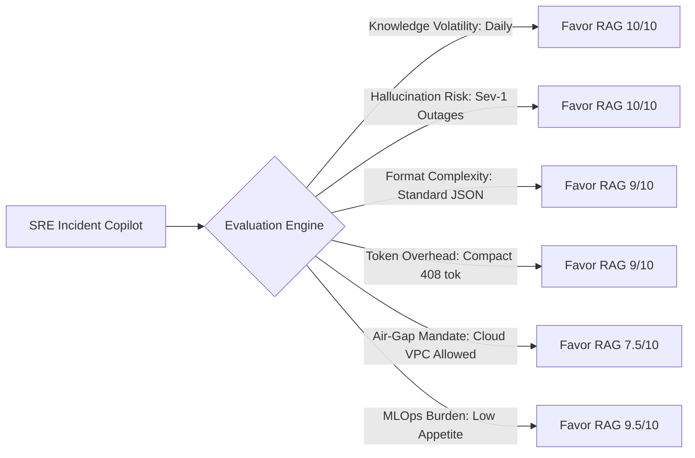

# Day 12 — Session 1: When to Fine-Tune

[](#)
[](#)
[-red.svg)](#)
[](#)

---

## 1. Executive Summary & Curriculum Objectives

In modern enterprise AI systems, **fine-tuning is frequently misapplied as a blunt instrument for knowledge acquisition**. This session establishes the engineering and economic boundaries between **Fine-Tuning**, **Retrieval-Augmented Generation (RAG)**, and **In-Context Optimization**, culminating in an architectural **Decision Memo** ([`DECISION_MEMO.md`](file:///c:/Users/harsh/OneDrive/Desktop/Agentic-AI/day_12/session_1/DECISION_MEMO.md)) for our production Capstone copilot (**OpsSentinel AI**).

### Session Learning Objectives
1. **Fine-tune for behaviour and format, RAG for knowledge**:
   - The fundamental architectural boundary: parametric weights store reasoning patterns, stylistic personas, and complex schemas; non-parametric vector/SQL databases store volatile operational facts.
2. **The Decision Framework**:
   - The 8-dimension evaluation matrix assessing knowledge volatility, grounding/hallucination severity, syntax rarity, token budgets, latency SLAs, air-gap constraints, and MLOps maintenance maturity.
3. **Cost and Maintenance Burden**:
   - Full lifecycle Total Cost of Ownership (TCO) modeling including dataset curation, QA labeling, GPU training hours, dedicated cloud infrastructure (e.g. AWS EC2 `g5.2xlarge` A10G), model drift, and retraining cycles.
4. **Why most teams should exhaust prompting first**:
   - The 5-level in-context optimization ladder (zero-shot $\rightarrow$ few-shot $\rightarrow$ schema pruning/context compaction $\rightarrow$ prompt caching $\rightarrow$ deterministic guardrails).

---

## 2. The Decision Memo at a Glance (RFC-2026-042)

Full publication-grade document: [`DECISION_MEMO.md`](file:///c:/Users/harsh/OneDrive/Desktop/Agentic-AI/day_12/session_1/DECISION_MEMO.md).

```text
===================================================================================================
                               EXECUTIVE DECISION SUMMARY: RFC-2026-042
===================================================================================================
TARGET SYSTEM : OpsSentinel AI (Autonomous SRE & Incident Response Copilot)
RECOMMENDATION: DO NOT FINE-TUNE THE MODEL AT THIS STAGE (STAY ON IN-CONTEXT RAG)
STATUS        : REJECTED FOR PHASE 1-2; APPROVED FOR IN-CONTEXT RAG + PROMPT CACHING
REVIEW BOARD  : Lead AI Architect, VP Platform Engineering, Head of SRE Operations, Principal MLOps
===================================================================================================
```

### The Core Axiom

```text
+-----------------------------------------------------------------------------------------------+
|                      THE BEHAVIOUR VS. KNOWLEDGE SEPARATION PRINCIPLE                         |
+-----------------------------------------------------------------------------------------------+
|  FINE-TUNING                                  |  RETRIEVAL-AUGMENTED GENERATION (RAG)         |
|  (Parametric Weights)                         |  (Non-Parametric Working Memory)              |
|-----------------------------------------------|-----------------------------------------------|
|  Controls HOW the model thinks and communicates|  Controls WHAT the model knows and references |
|  - Tone, style, conciseness, persona          |  - Dynamic facts, numbers, dates, statuses    |
|  - Idiosyncratic JSON/YAML syntax             |  - Evolving runbooks, SOPs, SLA definitions   |
|  - Domain-specific reasoning patterns         |  - Real-time telemetry, logs, active tickets  |
|  - Tool calling protocol adherence in SLMs    |  - Ground truth source citations & provenance |
|-----------------------------------------------|-----------------------------------------------|
|  Update Cadence: Weeks to Months (Expensive)  |  Update Cadence: Milliseconds (Free / Instant)|
+-----------------------------------------------------------------------------------------------+
```

---

## 3. Total Cost of Ownership (TCO) Comparison

### Upfront Capital Setup Costs
Fine-tuning requires substantial upfront data engineering before a single prompt can be served:
- **Dataset Curation** (50 SRE hrs @ $125/hr): **$6,250.00**
- **Synthetic Data Generation & Filtering**: **$1,500.00**
- **Expert QA Review & Human Labeling** (20 QA hrs @ $75/hr): **$1,500.00**
- **Training Compute** (48 hrs on 8x A100 GPU cluster): **$196.80**
- **Evaluation Harness & Regression Suite Setup** (25 MLOps hrs @ $125/hr): **$3,125.00**
- **Tool Calling & Guardrail Integration** (12 hrs @ $125/hr): **$1,500.00**
- **TOTAL UPFRONT INVESTMENT**: **$14,071.80** *(vs. $0.00 for In-Context RAG)*

### 12-Month Cumulative TCO Across Volume Milestones

| Monthly Query Volume | In-Context RAG + Cache (Mo) | Cloud Managed FT (Mo) | Dedicated Self-Hosted GPU (Mo) | In-Context RAG 12m TCO | Dedicated GPU 12m TCO (Inc Upfront) |
| :---: | :---: | :---: | :---: | :---: | :---: |
| **10,000** | $0.70 | $1.17 | $734.00 | **$8.42** | **$22,879.80** |
| **50,000 (Baseline)** | **$3.51** | **$5.85** | **$734.00** | **$42.08** | **$22,879.80** |
| **250,000** | $17.53 | $29.25 | $734.00 | **$210.41** | **$22,879.80** |
| **1,000,000** | $70.14 | $117.00 | $2,202.00 | **$841.63** | **$40,495.80** |
| **5,000,000** | $350.68 | $585.00 | $11,010.00 | **$4,208.17** | **$146,191.80** |

### Breakeven Analysis
- Unit RAG Cost per Query: **$0.000070 / query**
- Single Dedicated GPU Monthly Cost: **$734.00 / month**
- **Breakeven Threshold**: Would require **10,465,381 queries/month** just to match monthly hosting fees. Because a single GPU maxes out at ~350,000 queries/month, self-hosting is **never cheaper than serverless RAG**.

---

## 4. The 8-Dimension Decision Framework

The automated engine in [`decision_framework.py`](file:///c:/Users/harsh/OneDrive/Desktop/Agentic-AI/day_12/session_1/decision_framework.py) evaluates candidate AI initiatives across 8 dimensions:



- **Overall In-Context RAG Fit**: **90.9%**
- **Fine-Tuning Fit**: **40.1%**
- **Recommendation**: **Decisive Rejection of Fine-Tuning**

---

## 5. Phase 3 Re-Evaluation Gates ("Path to Yes")

We will only re-open the fine-tuning decision if at least **two** of the following exit criteria are met:
1. **Gate 1 (Scale)**: Production query volume exceeds **2,500,000 queries/month**.
2. **Gate 2 (Compliance)**: Strict regulatory compliance mandates a 100% on-premise air-gapped deployment.
3. **Gate 3 (Latency)**: Latency SLAs are tightened to **< 80 ms p95** for robotic/real-time packet routing.
4. **Gate 4 (Schema Incompatibility)**: Foundation base models fail to adhere to proprietary internal formats despite DSPy / few-shot optimization.

---

## 6. How to Run the Tools

### 1. View Executive Decision Memo Highlights
```bash
python day_12/session_1/main.py --memo
```

### 2. Run the 8-Dimension Architectural Assessment
```bash
python day_12/session_1/main.py --assess
```

### 3. Run the Total Cost of Ownership (TCO) & Breakeven Calculator
```bash
python day_12/session_1/main.py --tco
```

### 4. Launch the Interactive Exploration Workspace
```bash
python day_12/session_1/main.py
```
