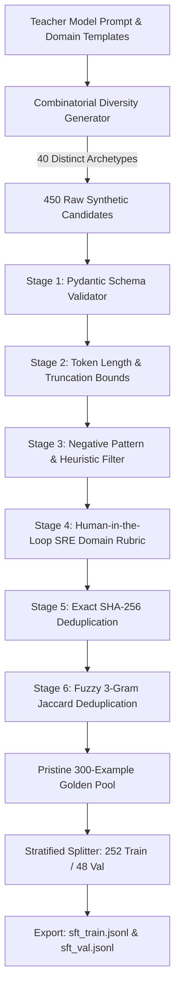

# SFT Dataset Quality Control & Curation Process

**Dataset Name:** `SRE-Structured-Triage-v1`  
**Target Task:** Automated SRE Alert-to-Remediation Triage & Structured Action Plan Formulation  
**Total Examples:** 300 Golden Samples (252 Train / 48 Validation)  
**Standard Format:** Chat Messages JSONL (`{"messages": [{"role": "system", ...}, {"role": "user", ...}, {"role": "assistant", ...}]}`)  
**Compatibility:** OpenAI Fine-Tuning, Google Vertex AI SFT, Hugging Face TRL (`SFTTrainer`), AWS Bedrock  

---

## 1. Executive Summary & The "Quality Over Quantity" Principle

When fine-tuning modern foundational models (e.g. Llama 3, Mistral, GPT-4o-mini, Gemini Flash), the defining empirical finding of recent alignment research (notably Zhou et al., **LIMA: Less Is More for Alignment**) is that:
> **A small, highly curated dataset of 300 to 1,000 pristine, format-consistent examples produces vastly superior instruction-following, higher tool-calling reliability, and fewer hallucinations than 50,000 noisy, duplicate, or unverified scraped web records.**

In Session 1, we proved that **RAG must be used for knowledge, while Fine-Tuning must be used for behavior and format**. Therefore, our dataset targets a strictly defined **narrow task**: teaching the model to ingest noisy, multi-modal system alerts and emit a deterministic, auditable, and structured JSON incident triage action plan.

---

## 2. The Narrow Task Specification

### Input (User Alert / Symptom)
Unstructured or semi-structured SRE inputs including Prometheus alerts, Kubernetes container crashes, Grafana metric spikes, application stack traces, or operator triage queries across 10 production microservices.

### Target Output (Assistant Action Plan)
A deterministic, strictly typed JSON object conforming to the following OpenAPI / Pydantic schema:

```json
{
  "severity": "SEV-1 | SEV-2 | SEV-3",
  "affected_service": "string",
  "category": "DATABASE | NETWORK_INGRESS | APPLICATION | INFRASTRUCTURE | SECURITY_AUTH",
  "root_cause_hypothesis": "string",
  "proposed_tool": "query_telemetry_db | read_system_logs | search_runbooks | calculate_metrics | restart_service | rollback_deployment | dispatch_emergency_alert",
  "tool_parameters": { "param_name": "param_value" },
  "blast_radius": "LOW | MEDIUM | HIGH | CRITICAL",
  "requires_approval": true,
  "remediation_steps": [
    "Step 1",
    "Step 2",
    "Step 3"
  ],
  "runbook_citation": "RUNBOOK-XX"
}
```

---

## 3. Teacher-Model Synthetic Generation Methodology

To overcome cold-start data scarcity without sacrificing quality, we implemented a **Teacher-Student Synthetic Distillation** pipeline:




### Diversity Seeding
To ensure high entropy and prevent the model from overfitting to repetitive phrasing, generation spanned:
1. **5 Core Architectural Pillars**: `DATABASE`, `NETWORK_INGRESS`, `APPLICATION`, `INFRASTRUCTURE`, `SECURITY_AUTH`.
2. **10 Production Services**: `payment-api`, `auth-service`, `postgres-db`, `redis-cluster`, `k8s-ingress`, `order-processor`, `kafka-event-bus`, `billing-worker`, `search-indexer`, `inventory-service`.
3. **40 Distinct Incident Archetypes**: Ranging from PostgreSQL connection pool exhaustion and Kafka consumer lag spikes to Cilium eBPF network drops and credential stuffing attacks.
4. **Parametric Telemetry Variance**: Latencies, memory percentages, connection counts, and IP addresses were randomized across realistic distributions.


## 4. Multi-Stage Quality-Control (QC) Pipeline

Every candidate example had to pass **six sequential validation gates** in [`quality_control.py`](file:///c:/Users/harsh/OneDrive/Desktop/Agentic-AI/day_12/session_2/quality_control.py):

### Gate 1: Strict Schema & Format Consistency Validation
- **Check**: The assistant message must parse as valid JSON and satisfy every constraint of the Pydantic `TriageActionPlan` model.
- **Rules**:
  - `severity` must be one of `["SEV-1", "SEV-2", "SEV-3"]`.
  - `category` must be one of `["DATABASE", "NETWORK_INGRESS", "APPLICATION", "INFRASTRUCTURE", "SECURITY_AUTH"]`.
  - `remediation_steps` must be a list of non-empty strings.
  - No extraneous or hallucinated keys permitted.
- **Failures**: 0 (Clean parsing).

### Gate 2: Sequence Length & Truncation Bounds
- **Check**: Sequence length constraints per provider documentation (OpenAI / Anthropic / Hugging Face).
- **Rules**:
  - `total_tokens <= 2048` (Avoid context truncation).
  - `user_prompt_tokens >= 15` (Reject trivial or vacuous prompts).
  - `assistant_completion_tokens >= 40` (Reject truncated action plans).
- **Failures**: 0.

### Gate 3: Negative Pattern & Placeholder Filtering
- **Check**: Regex scanning for synthetic artifacts and placeholders.
- **Forbidden Patterns**: `\[TODO\]`, `TODO`, `FIXME`, `<placeholder>`, `lorem ipsum`, `as an ai language model`, `xyz_service`.
- **Failures**: 0.

### Gate 4: Human-in-the-Loop (HITL) SRE Domain Rubric
- **Check**: Simulated expert SRE peer-review rules ensuring domain coherence.
- **Rules**:
  - **Blast-Radius Invariant**: If `proposed_tool` is destructive (`restart_service`, `rollback_deployment`), `requires_approval` **MUST** be `true`.
  - **Severity Invariant**: If `severity` is `SEV-1`, `blast_radius` **CANNOT** be `LOW`.
- **Failures Filtered**: **17 candidates rejected** for failing safety invariant alignment.

### Gate 5: Exact Deduplication (SHA-256)
- **Check**: SHA-256 hash of normalized user prompt text.
- **Failures**: 0 exact duplicates.

### Gate 6: Fuzzy Semantic Deduplication (Word 3-Gram Jaccard)
- **Check**: Detects and eliminates semantically near-identical prompts that differ only by punctuation or minor words.
- **Algorithm**: Jaccard similarity over word 3-grams:
  $$\text{Jaccard}(A, B) = \frac{|A \cap B|}{|A \cup B|}$$
- **Threshold**: Rejects any candidate with $\text{Jaccard} \ge 0.75$ against any previously accepted sample.
- **Failures Filtered**: **2 near-duplicate candidates rejected**, ensuring pristine dataset diversity.

---

## 5. Dataset Statistics & Stratification

### Train / Validation Split Mechanics
- **Total Golden Examples**: **300**
- **Train Set (`sft_train.jsonl`)**: **252 examples** (84.0%)
- **Validation Set (`sft_val.jsonl`)**: **48 examples** (16.0%)
- **Data Leakage Check**: Zero overlapping prompts between train and val; verified by disjoint SHA-256 hash sets.

### Category Distribution (Balanced Stratification)

| Category | Total Accepted | Train Set | Validation Set | Balance % |
| :--- | :---: | :---: | :---: | :---: |
| **DATABASE** | 58 | 49 | 9 | 19.3% |
| **NETWORK_INGRESS** | 61 | 51 | 10 | 20.3% |
| **APPLICATION** | 58 | 49 | 9 | 19.3% |
| **INFRASTRUCTURE** | 61 | 51 | 10 | 20.3% |
| **SECURITY_AUTH** | 62 | 52 | 10 | 20.7% |
| **TOTALS** | **300** | **252** | **48** | **100.0%** |

### Severity Distribution
- **SEV-1 (Critical Outage)**: 84 examples (28.0%)
- **SEV-2 (Major Degradation)**: 109 examples (36.3%)
- **SEV-3 (Minor Anomaly)**: 107 examples (35.7%)

### Token Budget & SFT Compute Estimation
- **Mean Prompt Tokens**: **62.2 tokens**
- **Mean Completion Tokens**: **178.6 tokens**
- **Mean Total Tokens per Example**: **240.8 tokens**
- **Total Training Tokens (3 epochs on 252 examples)**:
  $$\text{Total Tokens} = 252 \times 240.8 \times 3 \approx 182,044 \text{ tokens}$$
- **Estimated Fine-Tuning Compute Cost**:
  - OpenAI / Vertex AI API: $\approx \$182k \times \$8.00 / 1\text{M} = \mathbf{\$1.45}$
  - Self-hosted LoRA (1x A100 GPU): $\approx 15 \text{ minutes} = \mathbf{\$1.03}$

---

## 6. Provider Format Compatibility Guide

The generated files ([`sft_train.jsonl`](file:///c:/Users/harsh/OneDrive/Desktop/Agentic-AI/day_12/session_2/sft_train.jsonl) and [`sft_val.jsonl`](file:///c:/Users/harsh/OneDrive/Desktop/Agentic-AI/day_12/session_2/sft_val.jsonl)) are formatted to the OpenAI/Chat standard supported across major providers:

### 1. OpenAI Fine-Tuning API
```bash
curl https://api.openai.com/v1/fine_tuning/jobs \
  -H "Authorization: Bearer $OPENAI_API_KEY" \
  -H "Content-Type: application/json" \
  -d '{
    "training_file": "file-xyz-train",
    "validation_file": "file-xyz-val",
    "model": "gpt-4o-mini-2024-07-18"
  }'
```

### 2. Google Cloud Vertex AI (Gemini SFT)
Upload `sft_train.jsonl` directly to Google Cloud Storage (`gs://my-bucket/sft_train.jsonl`) for supervised tuning on `gemini-1.5-flash`.

### 3. Hugging Face TRL (`SFTTrainer`)
```python
from datasets import load_dataset
from trl import SFTTrainer

dataset = load_dataset("json", data_files={"train": "sft_train.jsonl", "validation": "sft_val.jsonl"})
# Directly consumable by SFTTrainer with conversation formatting!
```
