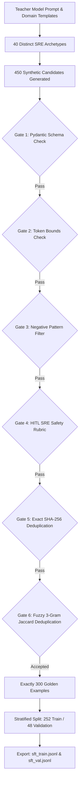

# Day 12 — Session 2: SFT Dataset Preparation & Quality Control

[](#)
[](#)
[](#)
[](#)

---

## 1. Executive Summary & Curriculum Objectives

In Supervised Fine-Tuning (SFT), **dataset quality dictates model capability**. While pre-training demands massive scale (trillions of tokens), alignment research (e.g., the **LIMA** principle: *Less Is More for Alignment*) demonstrates that a compact, format-consistent dataset of **300 to 1,000 pristine examples** is vastly superior to 50,000 unverified scraped records.

### Session Learning Objectives
1. **Building an SFT Dataset for a Narrow Task**: Designing targeted training data for structured behavior rather than raw knowledge ingestion.
2. **Quality over Quantity (LIMA Principle)**: Eliminating syntactic drift and cognitive noise through aggressive curation.
3. **Format Consistency**: Ensuring 100% adherence to OpenAPI / Pydantic JSON schemas across all assistant turns.
4. **Deduplication**: Multi-tier duplicate pruning combining exact SHA-256 hashes and fuzzy word 3-gram Jaccard distance.
5. **Stratified Train/Val Split**: Splitting 300 examples into 252 Train / 48 Val without data leakage.
6. **Teacher-Model Distillation & Human-in-the-Loop Filtering**: Using frontier models to synthesize candidates and simulated SRE expert rubrics to reject safety violations.

---

## 2. The Narrow Task: `SRE-Structured-Triage-v1`

- **Task**: Ingest unstructured or semi-structured SRE incident alerts (Prometheus metrics, container crashes, stack traces, latency spikes) and generate a **strictly typed JSON incident triage and remediation action plan**.
- **Standard Format**: Chat Messages JSONL (`{"messages": [{"role": "system", ...}, {"role": "user", ...}, {"role": "assistant", ...}]}`).
- **Target Schema (`TriageActionPlan`)**:
  - `severity`: `"SEV-1"` | `"SEV-2"` | `"SEV-3"`
  - `affected_service`: Microservice name (e.g., `payment-api`, `auth-service`, `postgres-db`)
  - `category`: `"DATABASE"` | `"NETWORK_INGRESS"` | `"APPLICATION"` | `"INFRASTRUCTURE"` | `"SECURITY_AUTH"`
  - `root_cause_hypothesis`: Concise technical diagnosis
  - `proposed_tool`: Exact tool name from Capstone tool catalog
  - `tool_parameters`: Valid dictionary arguments
  - `blast_radius`: `"LOW"` | `"MEDIUM"` | `"HIGH"` | `"CRITICAL"`
  - `requires_approval`: Boolean gate for destructive actions
  - `remediation_steps`: Ordered list of actionable commands
  - `runbook_citation`: Exact SOP citation (e.g. `RUNBOOK-01` through `RUNBOOK-40`)

---

## 3. Dataset Generation & Quality Control Architecture



### Quality Control Pipeline Results

```text
===================================================================================================
                               QUALITY CONTROL & FILTER REPORT
===================================================================================================
Total Candidates Evaluated           :  450 examples
Exact Duplicates Removed (SHA-256)   :    0 examples
Fuzzy Duplicates Removed (Jaccard)   :    2 examples (Jaccard > 0.75)
HITL Safety Rubric Violations Pruned :   17 examples (Destructive tools without approval / Sev-1 mismatch)
Final Accepted Golden Pool           :  300 pristine examples (66.7% retention)
===================================================================================================
```

---

## 4. Stratified Split & Token Statistics

### Category Stratification (Balanced 5-Pillar Split)

| Category | Total Count | Train Count (`sft_train.jsonl`) | Validation Count (`sft_val.jsonl`) | Stratification Status |
| :--- | :---: | :---: | :---: | :---: |
| **DATABASE** | 58 | 49 | 9 | **Balanced (19.3%)** |
| **NETWORK_INGRESS** | 61 | 51 | 10 | **Balanced (20.3%)** |
| **APPLICATION** | 58 | 49 | 9 | **Balanced (19.3%)** |
| **INFRASTRUCTURE** | 61 | 51 | 10 | **Balanced (20.3%)** |
| **SECURITY_AUTH** | 62 | 52 | 10 | **Balanced (20.7%)** |
| **TOTAL** | **300** | **252 (84.0%)** | **48 (16.0%)** | **100.0%** |

### Severity Distribution
- **SEV-1 (Critical Incident)**: 84 examples (28.0%)
- **SEV-2 (Major Degradation)**: 109 examples (36.3%)
- **SEV-3 (Minor Anomaly)**: 107 examples (35.7%)

### Token Metrics & Training Economics
- **Mean Prompt Tokens**: **62.2 tokens**
- **Mean Completion Tokens**: **178.6 tokens**
- **Mean Total Tokens / Example**: **240.8 tokens**
- **Total Training Tokens (3 Epochs)**: $\approx 182,044$ tokens
- **Training Cost on OpenAI / Vertex AI API**: $\approx \mathbf{\$1.45}$

---

## 5. Artifacts in `day_12/session_2/`

- [`sft_train.jsonl`](file:///c:/Users/harsh/OneDrive/Desktop/Agentic-AI/day_12/session_2/sft_train.jsonl): 252 training examples in provider Chat format.
- [`sft_val.jsonl`](file:///c:/Users/harsh/OneDrive/Desktop/Agentic-AI/day_12/session_2/sft_val.jsonl): 48 validation examples in provider Chat format.
- [`sft_full_300.jsonl`](file:///c:/Users/harsh/OneDrive/Desktop/Agentic-AI/day_12/session_2/sft_full_300.jsonl): Complete 300-example master dataset.
- [`sft_metadata.json`](file:///c:/Users/harsh/OneDrive/Desktop/Agentic-AI/day_12/session_2/sft_metadata.json): Machine-readable dataset card and checksums.
- [`dataset_generator.py`](file:///c:/Users/harsh/OneDrive/Desktop/Agentic-AI/day_12/session_2/dataset_generator.py): Candidate synthesizer across 40 archetypes.
- [`quality_control.py`](file:///c:/Users/harsh/OneDrive/Desktop/Agentic-AI/day_12/session_2/quality_control.py): 6-stage QC pipeline and deduplication engine.
- [`dataset_pipeline.py`](file:///c:/Users/harsh/OneDrive/Desktop/Agentic-AI/day_12/session_2/dataset_pipeline.py): Stratified train/val splitter and exporter.
- [`QUALITY_CONTROL_PROCESS.md`](file:///c:/Users/harsh/OneDrive/Desktop/Agentic-AI/day_12/session_2/QUALITY_CONTROL_PROCESS.md): Complete quality-control documentation.
- [`main.py`](file:///c:/Users/harsh/OneDrive/Desktop/Agentic-AI/day_12/session_2/main.py): Interactive CLI and format linter.

---

## 6. How to Run & Verify

### 1. Run the Provider Format Linter (100% Compliance Check)
python day_12/session_2/main.py --verify

### 2. View the Quality Control & Stratification Report
python day_12/session_2/main.py --report

### 3. Inspect Random Formatted Golden Samples
python day_12/session_2/main.py --sample


### 4. Launch the Interactive Exploration CLI
python day_12/session_2/main.py

